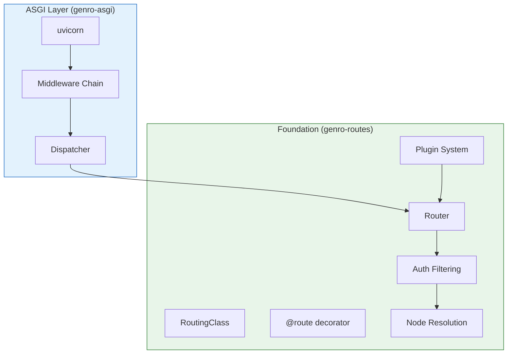
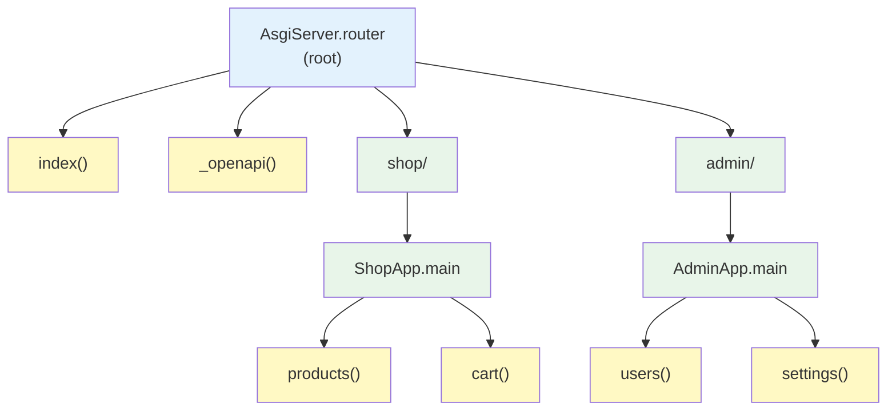

# genro-routes: The Server Foundation

genro-routes is not just a dependency — it is the **foundation** on which genro-asgi is built. While genro-asgi handles the ASGI protocol (HTTP, WebSocket, lifespan), genro-routes does the heavy lifting of routing, authorization, and request dispatching.

## Architecture Overview



**genro-asgi provides**: ASGI protocol handling, middleware, request/response objects

**genro-routes provides**: Routing, authorization, validation plugins, handler resolution

## What genro-routes Does

| Responsibility | Description |
| -------------- | ----------- |
| **Path Resolution** | Maps URL paths to handler methods |
| **Hierarchical Routing** | Builds tree of Server → Apps → Handlers |
| **Authorization Filtering** | Filters routes by `auth_tags` |
| **Capability Filtering** | Filters routes by `env_capabilities` |
| **Plugin System** | Validation (Pydantic), logging, custom plugins |
| **Metadata Management** | Carries `mime_type`, `cache`, custom metadata to response |

## Why a Separate Library?

genro-routes is intentionally **protocol-agnostic**:

```python
# genro-routes works WITHOUT any ASGI/HTTP knowledge
router = Router(owner, name="main")
node = router.node("/users/42", auth_tags=["admin"])
result = node(id=42)  # Just a callable

# genro-asgi wraps it for HTTP
class Dispatcher:
    async def __call__(self, scope, receive, send):
        node = self.router.node(request.path, ...)
        result = await smartasync(node)(**request.query)
        # Convert to HTTP response
```

Benefits:

- **Testable without HTTP**: Test routing logic directly
- **Reusable**: Same routing for HTTP, WebSocket, CLI, batch jobs
- **Clean separation**: Protocol concerns stay in genro-asgi

## Instance-Scoped Routing

The defining feature of genro-routes is **instance-scoped routing** — routes belong to instances, not modules.

### Traditional (Blueprint-Based)

```python
# Flask/FastAPI: routes are global
app = Flask(__name__)

@app.route("/users")  # Global registration
def get_users():
    return db.query()  # Which db? Global state needed
```

### genro-routes (Instance-Scoped)

```python
# genro-routes: routes belong to the instance
class UserApp(AsgiApplication):
    def __init__(self, db):
        self.db = db  # Instance owns its state

    @route()
    def users(self):
        return self.db.query()  # Clear: self.db

# Multiple instances, each with own routes and state
app1 = UserApp(db=production_db)
app2 = UserApp(db=test_db)

del app1  # Routes and state garbage collected
```

## Core Components

### RoutingClass

Base class that both `AsgiServer` and `AsgiApplication` extend:

```python
from genro_routes import RoutingClass, Router

class AsgiServer(RoutingClass):
    def __init__(self):
        self.router = Router(self, name="root")  # Server's router

class AsgiApplication(RoutingClass):
    def __init__(self):
        self.main = Router(self, name="main")  # App's router
```

### Router

The container that manages path → handler resolution:

```python
# Create router owned by an instance
router = Router(owner=self, name="root")

# Resolve path to handler
node = router.node(
    "/shop/products",
    auth_tags=["user"],
    env_capabilities=["beta"],
    errors=ROUTER_ERRORS,
)

# Node is callable with metadata
result = node(category="electronics")
mime_type = node.metadata.get("mime_type")
```

### @route Decorator

Registers instance methods as endpoints:

```python
class ShopApp(AsgiApplication):
    @route()  # Default router (self.main)
    def products(self, category: str = None):
        return self.db.search(category)

    @route("main", auth_tags="admin")
    def inventory(self):
        return self.db.get_inventory()

    @route(meta_mime_type="text/csv")
    def export(self):
        return self.generate_csv()
```

### attach_instance

Connects apps to the server's routing tree:

```python
# In AsgiServer.__init__
for name, app_instance in apps.items():
    self.router.attach_instance(app_instance, name=name)
    # Now /shop/... routes to ShopApp
    # And /admin/... routes to AdminApp
```

## Routing Hierarchy

genro-routes builds a **hierarchical tree**:



Path resolution: `/shop/products` → root → shop → main → products

## Plugin System

genro-routes supports **plugins** that hook into the routing pipeline:

```yaml
# config.yaml
plugins:
  pydantic:
    strict: true
  logging:
    level: debug
```

```python
# Applied during server init
for name, opts in config.get_plugin_specs().items():
    self.router.plug(name, **opts)
```

### Pydantic Plugin (Validation)

Validates handler parameters using Pydantic models:

```python
from pydantic import BaseModel

class ProductQuery(BaseModel):
    category: str
    min_price: float = 0.0

class ShopApp(AsgiApplication):
    @route()
    def products(self, query: ProductQuery):
        # query is validated — invalid input raises validation_error
        return self.db.search(query.category, query.min_price)
```

### Auth Plugin (Authorization Tags)

Filters access based on `auth_tags`:

```python
@route(auth_tags="admin")  # Requires "admin" tag
def delete_user(self, user_id: int):
    ...

@route(auth_tags="admin&write")  # Requires BOTH tags
def update_user(self, user_id: int, data: dict):
    ...

@route(auth_tags="admin|superuser")  # Requires EITHER tag
def view_logs(self):
    ...
```

Auth tag syntax:

| Syntax | Meaning |
| ------ | ------- |
| `"admin"` | Requires "admin" |
| `"admin&write"` | Requires "admin" AND "write" |
| `"admin|super"` | Requires "admin" OR "super" |
| `"admin&(read|write)"` | Complex: admin AND (read OR write) |

### Env Plugin (Environment Capabilities)

Filters routes by environment capabilities:

```python
@route(env_capabilities="beta_features")
def experimental_feature(self):
    # Only available when beta_features capability is present
    ...

@route(env_capabilities="paid_tier")
def premium_export(self):
    # Only for paid tier environments
    ...
```

Use cases:

| Capability | Purpose |
| ---------- | ------- |
| `beta_features` | Feature flags |
| `paid_tier` | Premium features |
| `debug_mode` | Debug endpoints |
| `region_eu` | Region-specific routes |

## The Dispatcher: ASGI ↔ genro-routes Bridge

The Dispatcher in genro-asgi is a thin bridge that:

1. **Receives** ASGI scope/receive/send
2. **Calls** genro-routes to resolve the handler
3. **Executes** the handler
4. **Converts** result to ASGI response

```python
class Dispatcher:
    async def __call__(self, scope, receive, send):
        # 1. Create request from ASGI
        request = await self.request_registry.create(scope, receive, send)

        # 2. genro-routes does the heavy lifting
        node = self.router.node(
            request.path,
            auth_tags=request.auth_tags,
            env_capabilities=request.env_capabilities,
            errors=ROUTER_ERRORS,
        )

        # 3. Execute handler
        result = await smartasync(node)(**dict(request.query))

        # 4. Convert to ASGI response
        request.response.set_result(result, node.metadata)
        await request.response(scope, receive, send)
```

The Dispatcher is ~25 lines of code. **genro-routes does the real work.**

## Error Mapping

genro-routes raises semantic errors. The Dispatcher maps them to HTTP:

| genro-routes Error | HTTP Exception | Status |
| ------------------ | -------------- | ------ |
| `not_found` | `HTTPNotFound` | 404 |
| `not_authorized` | `HTTPForbidden` | 403 |
| `not_authenticated` | `HTTPUnauthorized` | 401 |
| `validation_error` | `HTTPBadRequest` | 400 |
| `not_available` | `HTTPServiceUnavailable` | 503 |

## Summary

| Component | Role |
| --------- | ---- |
| **genro-routes** | The foundation — routing, auth, plugins, handler resolution |
| **genro-asgi** | The protocol layer — ASGI, HTTP, middleware, request/response |
| **Dispatcher** | The bridge — translates between ASGI and genro-routes |

genro-asgi without genro-routes would be just middleware and protocol handling. genro-routes **is** the routing system.

## Related Documents

- [Dispatcher](../02_server_foundation/04_dispatcher.md) - The ASGI ↔ genro-routes bridge
- [Core Principles](02_core_principles.md) - Instance isolation principle
- [Terminology](03_terminology.md) - Glossary of terms
