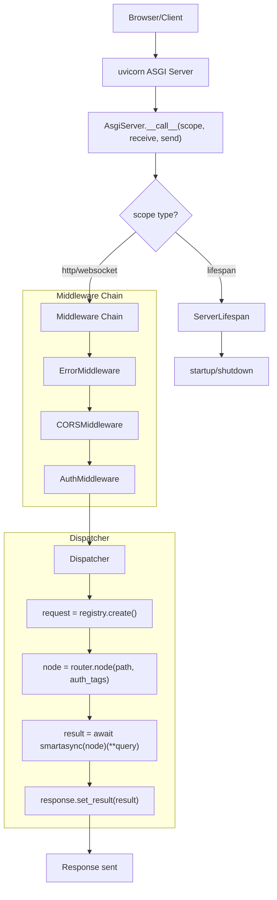
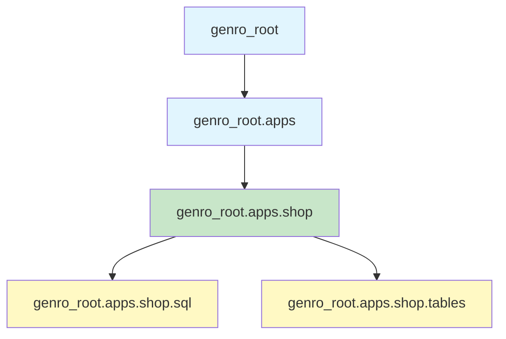

# AsgiServer: The Orchestrator

The `AsgiServer` is the central coordinator of genro-asgi. It handles configuration, mounts applications, builds the middleware chain, and routes requests.

## Source Location

**File**: `src/genro_asgi/server.py`

## Class Definition

```python
class AsgiServer(RoutingClass):
    """Base ASGI server with routing via genro_routes."""

    __slots__ = (
        "apps",
        "router",
        "config",
        "base_dir",
        "logger",
        "lifespan",
        "request_registry",
        "dispatcher",
        "storage",
        "resource_loader",
        "openapi_info",
        "app_loader",
    )

    def __init__(
        self,
        server_dir: str | Path | None = None,
        host: str | None = None,
        port: int | None = None,
        reload: bool | None = None,
        argv: list[str] | None = None,
    ) -> None:
        ...
```

## Attributes

| Attribute | Type | Description |
| --------- | ---- | ----------- |
| `config` | `ServerConfig` | Configuration from YAML + CLI + env |
| `base_dir` | `Path` | Resolved server directory |
| `router` | `Router` | Root router (genro-routes), name="root" |
| `apps` | `dict[str, RoutingClass]` | Mounted applications by name |
| `dispatcher` | `Middleware` | Middleware chain terminating in Dispatcher |
| `lifespan` | `ServerLifespan` | Handles startup/shutdown |
| `request_registry` | `RequestRegistry` | Tracks in-flight requests |
| `storage` | `LocalStorage` | Filesystem access |
| `resource_loader` | `ResourceLoader` | Hierarchical resource loading |
| `openapi_info` | `dict[str, Any]` | OpenAPI metadata |
| `app_loader` | `AppLoader` | Isolated module loading |
| `logger` | `Logger` | Server logger instance |

## Initialization Sequence

When `AsgiServer.__init__()` is called:

```python
def __init__(self, server_dir=None, host=None, port=None, reload=None, argv=None):
    # 1. Load configuration
    self.config = ServerConfig(server_dir, host, port, reload, argv)
    self.base_dir = self.config.server["server_dir"]

    # 2. Create core components
    self.apps = {}
    self.router = Router(self, name="root")
    self.storage = LocalStorage(self.base_dir)
    self.resource_loader = ResourceLoader(self)

    # 3. Configure router plugins
    for name, opts in self.config.get_plugin_specs().items():
        self.router.plug(name, **opts)

    # 4. Create lifecycle and request management
    self.logger = logging.getLogger("genro_asgi")
    self.lifespan = ServerLifespan(self)
    self.request_registry = RequestRegistry()

    # 5. Build middleware chain
    self.dispatcher = middleware_chain(
        self.config.middleware,
        Dispatcher(self),
        full_config=self.config._opts
    )

    # 6. Load and mount apps
    self.app_loader = AppLoader()
    for name, (module_name, class_name, kwargs) in self.config.get_app_specs_raw().items():
        # Load app into virtual namespace
        self.app_loader.load_package(name, app_dir)
        app_module = self.app_loader.get_module(name, module_name)
        cls = getattr(app_module, class_name)

        # Instantiate and mount
        kwargs["base_dir"] = app_dir
        instance = cls(**kwargs)
        instance._mount_name = name
        self.apps[name] = instance
        self.router.attach_instance(instance, name=name)

    # 7. Set default route
    self.router.default_entry = "index"
    self.openapi_info = self.config.openapi
```

## ASGI Interface

The server implements the ASGI protocol:

```python
async def __call__(self, scope: Scope, receive: Receive, send: Send) -> None:
    if scope["type"] == "lifespan":
        await self.lifespan(scope, receive, send)
    else:
        await self.dispatcher(scope, receive, send)
```

**Request types handled**:

| Scope Type | Handler |
| ---------- | ------- |
| `lifespan` | `self.lifespan` (startup/shutdown) |
| `http` | `self.dispatcher` (middleware → handler) |
| `websocket` | `self.dispatcher` (middleware → handler) |

## Request Flow



## System Routes

The server exposes system endpoints on the root router:

| Route | Method | Description |
| ----- | ------ | ----------- |
| `index()` | `@route("root")` | Default page, redirects to main_app |
| `_openapi(*args)` | `@route("root")` | OpenAPI schema endpoint |
| `load_resource(*args, name=)` | `@route(name="_resource")` | Hierarchical resource loading |
| `_create_jwt(...)` | `@route("root", auth_tags="superadmin&has_jwt")` | JWT creation (admin only) |

### Index Route

```python
@route("root", meta_mime_type="text/html")
def index(self) -> str:
    """Default index page. Redirects to main_app if configured."""
    if self.main_app:
        raise Redirect(f"/{self.main_app}/")
    html_path = Path(__file__).parent / "resources" / "html" / "default_index.html"
    return html_path.read_text()
```

### OpenAPI Route

```python
@route("root", meta_mime_type="application/json")
def _openapi(self, *args: str) -> dict[str, Any]:
    """OpenAPI schema endpoint."""
    basepath = "/".join(args) if args else None
    paths = self.router.nodes(basepath=basepath, mode="openapi")
    return {
        "openapi": "3.1.0",
        "info": self.openapi_info,
        **paths,
    }
```

## Properties

### main_app

Returns the main application name (for redirect):

```python
@property
def main_app(self) -> str | None:
    """Return main app name: configured or single app."""
    configured = self.config["main_app"]
    if configured:
        return configured
    apps = self.config["apps"]
    return next(iter(apps)) if len(apps) == 1 else None
```

### request / response

Access current request/response via ContextVar:

```python
@property
def request(self) -> BaseRequest | None:
    """Current request from registry."""
    return self.request_registry.current

@property
def response(self) -> Response | None:
    """Current response from request."""
    req = self.request
    return req.response if req else None
```

## Running the Server

### Programmatic

```python
from genro_asgi import AsgiServer

server = AsgiServer(server_dir="./myapp")
server.run()  # Starts uvicorn
```

### run() Method

```python
def run(self) -> None:
    """Run the server using Uvicorn."""
    host = self.config.server["host"]
    port = self.config.server["port"]
    reload = self.config.server["reload"] or False

    if reload:
        # Uvicorn requires import string for reload mode
        os.environ["GENRO_ASGI_SERVER_DIR"] = str(self.base_dir)
        uvicorn.run(
            "genro_asgi:AsgiServer",
            host=host,
            port=port,
            reload=True,
            reload_dirs=[str(self.base_dir)],
            factory=True,
        )
    else:
        uvicorn.run(self, host=host, port=port)
```

### CLI

```bash
# Via installed command
genro-asgi serve ./myapp --port 9000

# Via python -m
python -m genro_asgi serve ./myapp --port 9000
```

## App Mounting

Applications are mounted via the router hierarchy:

```python
# Server mounts app with name
self.router.attach_instance(app_instance, name="shop")

# Routes become accessible at /shop/*
# app.main.get("products") → /shop/products
```

**Mount process**:

1. `ServerConfig.get_app_specs_raw()` returns `{name: (module, class, kwargs)}`
2. `AppLoader.load_package()` loads module into virtual namespace
3. App class is instantiated with kwargs from config
4. `router.attach_instance(app, name=name)` connects to routing tree
5. App's `_mount_name` is set for identification

## AppLoader: Isolated Module Loading

**File**: `src/genro_asgi/loader.py`

Loads app modules into virtual namespace to avoid `sys.path` pollution:

```python
app_loader = AppLoader()  # prefix="genro_root"

# Load app package
app_loader.load_package("shop", Path("/apps/shop"))
# Registered as: genro_root.apps.shop

# Apps can use relative imports:
# from .sql import Table → genro_root.apps.shop.sql
```

**Namespace structure**:



## Dispatcher

**File**: `src/genro_asgi/dispatcher.py`

The innermost layer of the middleware chain:

```python
class Dispatcher:
    __slots__ = ("server",)

    def __init__(self, server: AsgiServer) -> None:
        self.server = server

    async def __call__(self, scope: Scope, receive: Receive, send: Send) -> None:
        request = await self.request_registry.create(scope, receive, send)
        set_current_request(request)

        try:
            node = self.router.node(
                request.path,
                auth_tags=request.auth_tags,
                env_capabilities=request.env_capabilities,
                errors=ROUTER_ERRORS,
            )

            result = await smartasync(node)(**dict(request.query))

            if is_result_wrapper(result):
                metadata = {**node.metadata, **result.metadata}
                request.response.set_result(result.value, metadata)
            else:
                request.response.set_result(result, node.metadata)

            await request.response(scope, receive, send)
        finally:
            set_current_request(None)
            self.request_registry.unregister()
```

**Router error mapping**:

| Router Error | HTTP Exception | Status |
| ------------ | -------------- | ------ |
| `not_found` | `HTTPNotFound` | 404 |
| `not_authorized` | `HTTPForbidden` | 403 |
| `not_authenticated` | `HTTPUnauthorized` | 401 |
| `not_available` | `HTTPServiceUnavailable` | 503 |
| `validation_error` | `HTTPBadRequest` | 400 |

## Design Decisions

### 1. Instance Isolation

Server is an instance with own state, not a global:

```python
server = AsgiServer(server_dir=".")
del server  # Everything garbage collected
```

### 2. RoutingClass Inheritance

Server extends `RoutingClass` from genro-routes:

- Enables `@route("root")` decorators on server methods
- Uses `router.attach_instance()` for app mounting
- Participates in routing tree hierarchy

### 3. Router Name "root"

Server's router is named "root" (not "main") to distinguish from app routers:

```python
# Server
self.router = Router(self, name="root")

# Apps
self.main = Router(self, name="main")
```

### 4. Middleware Chain Order

Middleware are ordered by `middleware_order` attribute:

| Order | Middleware | Purpose |
| ----- | ---------- | ------- |
| 100 | ErrorMiddleware | Exception handling (outermost) |
| 200 | LoggingMiddleware | Request logging |
| 300 | CORSMiddleware | CORS headers |
| 400 | AuthMiddleware | Authentication |
| 500-800 | Custom | Business logic |
| 900 | CompressionMiddleware | Response compression (innermost) |

## Related Documents

- [Configuration System](02_configuration.md) - ServerConfig and YAML
- [Server Lifecycle](03_lifecycle.md) - Startup/shutdown
- [Middleware Chain](../06_security_and_middleware/01_middleware_chain.md) - Middleware details
