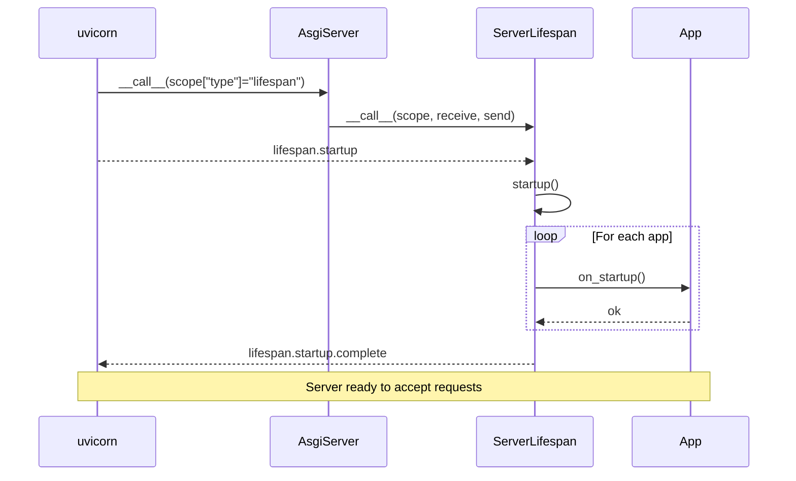
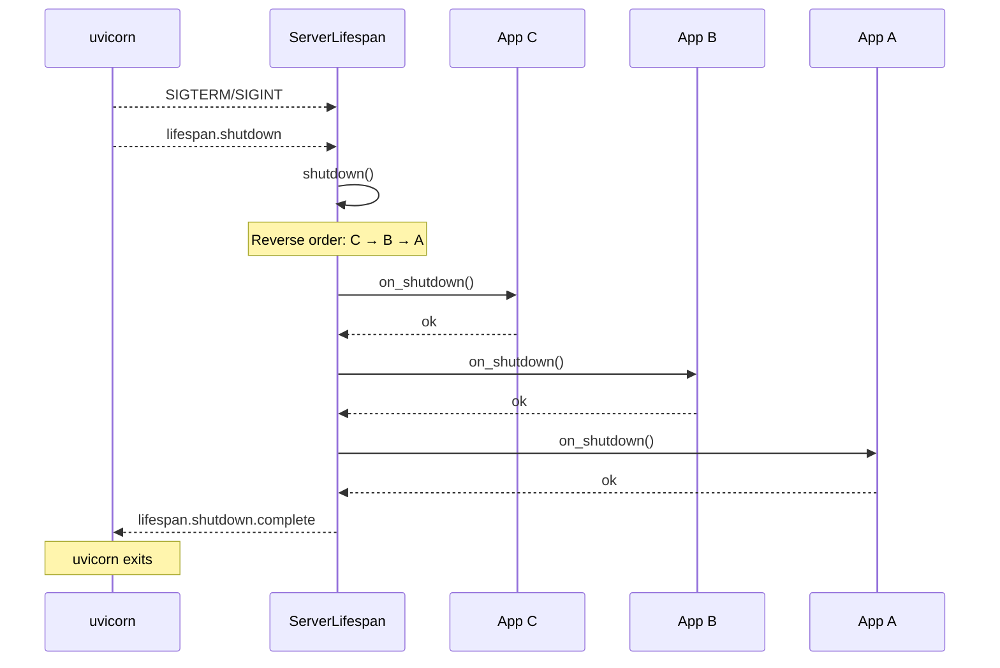

# Server Lifecycle and Lifespan

The ASGI lifespan protocol allows genro-asgi to manage startup and shutdown sequences for the server and all mounted applications.

## Source Location

**File**: `src/genro_asgi/lifespan.py`

## ServerLifespan Class

```python
class ServerLifespan:
    """ASGI Lifespan handler for AsgiServer."""

    __slots__ = ("server", "_logger", "_started")

    def __init__(self, server: AsgiServer) -> None:
        self.server = server
        self._logger = logging.getLogger("genro_asgi.lifespan")
        self._started = False
```

### Attributes

| Attribute | Type | Description |
| --------- | ---- | ----------- |
| `server` | `AsgiServer` | Reference to the server instance |
| `_logger` | `Logger` | Lifespan-specific logger |
| `_started` | `bool` | Tracks if startup completed |

## ASGI Lifespan Protocol

The lifespan protocol uses message-based communication:

```python
async def __call__(self, scope: Scope, receive: Receive, send: Send) -> None:
    while True:
        message = await receive()
        msg_type = message["type"]

        if msg_type == "lifespan.startup":
            try:
                await self.startup()
                await send({"type": "lifespan.startup.complete"})
            except Exception as e:
                self._logger.exception("Startup failed")
                await send({
                    "type": "lifespan.startup.failed",
                    "message": str(e),
                })
                return

        elif msg_type == "lifespan.shutdown":
            try:
                await self.shutdown()
            except Exception:
                self._logger.exception("Shutdown error")
            finally:
                await send({"type": "lifespan.shutdown.complete"})
            return
```

### Message Types

| Message | Direction | Description |
| ------- | --------- | ----------- |
| `lifespan.startup` | receive | Server requests startup |
| `lifespan.startup.complete` | send | Startup succeeded |
| `lifespan.startup.failed` | send | Startup failed (with message) |
| `lifespan.shutdown` | receive | Server requests shutdown |
| `lifespan.shutdown.complete` | send | Shutdown complete |

## Startup Sequence

```python
async def startup(self) -> None:
    """Execute startup sequence."""
    self._logger.info("AsgiServer starting up...")

    # Call on_startup on all mounted apps
    for path, app in self.server.apps.items():
        if hasattr(app, "on_startup"):
            self._logger.debug(f"Starting app at {path}")
            await self._call_handler(app, "on_startup")

    self._started = True
    self._logger.info("AsgiServer started")
```

### Startup Flow



### Error Handling

If startup fails:

1. Exception is logged
2. `lifespan.startup.failed` message sent with error message
3. Server does not start accepting requests
4. uvicorn exits

## Shutdown Sequence

```python
async def shutdown(self) -> None:
    """Execute shutdown sequence."""
    self._logger.info("AsgiServer shutting down...")

    # Call on_shutdown on all mounted apps in REVERSE order
    for path, app in reversed(list(self.server.apps.items())):
        if hasattr(app, "on_shutdown"):
            self._logger.debug(f"Stopping app at {path}")
            try:
                await self._call_handler(app, "on_shutdown")
            except Exception:
                self._logger.exception(f"Error shutting down app at {path}")

    self._started = False
    self._logger.info("AsgiServer stopped")
```

### Shutdown Flow



### Reverse Order

Apps are shut down in **reverse order** of startup:

- If apps were started: A → B → C
- They are shut down: C → B → A

This ensures dependencies are respected (apps started later may depend on earlier ones).

### Error Resilience

Shutdown errors are logged but don't prevent other apps from shutting down:

```python
try:
    await self._call_handler(app, "on_shutdown")
except Exception:
    self._logger.exception(f"Error shutting down app at {path}")
    # Continue with next app
```

## Handler Calling

The `_call_handler` method supports both sync and async handlers:

```python
async def _call_handler(self, app: object, method_name: str) -> None:
    """Call a handler method on an app (sync or async)."""
    handler = getattr(app, method_name)
    if callable(handler):
        result = handler()
        if hasattr(result, "__await__"):
            await result
```

This allows apps to define either:

```python
# Sync handler
def on_startup(self):
    self.db = connect_db()

# Async handler
async def on_startup(self):
    self.db = await async_connect_db()
```

## Application Lifecycle Hooks

Applications can define these lifecycle methods:

| Hook | When Called | Use Case |
| ---- | ----------- | -------- |
| `on_init(**kwargs)` | After `__init__` | Process config kwargs |
| `on_startup()` | Server startup | Open connections, load resources |
| `on_shutdown()` | Server shutdown | Close connections, cleanup |

### Example Application

```python
class MyApp(AsgiApplication):
    def on_init(self, db_uri: str, **kwargs):
        """Process config parameters."""
        self.db_uri = db_uri
        self.db = None

    async def on_startup(self):
        """Open database connection."""
        self.db = await create_engine(self.db_uri)
        await self.db.connect()

    async def on_shutdown(self):
        """Close database connection."""
        if self.db:
            await self.db.disconnect()
```

## Complete Lifecycle Timeline

```mermaid
stateDiagram-v2
    [*] --> Initialization: python -m genro_asgi serve

    state Initialization {
        [*] --> LoadConfig: AsgiServer.__init__()
        LoadConfig --> CreateComponents: config loaded
        CreateComponents --> BuildMiddleware: router, storage created
        BuildMiddleware --> LoadApps: middleware chain built

        state LoadApps {
            [*] --> LoadModule: AppLoader.load_package()
            LoadModule --> Instantiate: cls(**kwargs)
            Instantiate --> OnInit: app.on_init(**kwargs)
            OnInit --> Mount: router.attach_instance()
            Mount --> [*]
        }

        LoadApps --> [*]: all apps mounted
    }

    Initialization --> LifespanStartup: uvicorn starts

    state LifespanStartup {
        [*] --> ReceiveStartup: lifespan.startup
        ReceiveStartup --> CallStartup: ServerLifespan.startup()

        state CallStartup {
            [*] --> AppStartup: for each app
            AppStartup --> AppStartup: app.on_startup()
            AppStartup --> [*]: all started
        }

        CallStartup --> SendComplete: lifespan.startup.complete
        SendComplete --> [*]
    }

    LifespanStartup --> Running: ready

    state Running {
        [*] --> AcceptRequest
        AcceptRequest --> Middleware: scope["type"]=http
        Middleware --> Dispatcher
        Dispatcher --> Handler
        Handler --> Response
        Response --> AcceptRequest
    }

    Running --> LifespanShutdown: SIGTERM/SIGINT

    state LifespanShutdown {
        [*] --> ReceiveShutdown: lifespan.shutdown
        ReceiveShutdown --> CallShutdown: ServerLifespan.shutdown()

        state CallShutdown {
            [*] --> AppShutdown: for each app REVERSE
            AppShutdown --> AppShutdown: app.on_shutdown()
            AppShutdown --> [*]: all stopped
        }

        CallShutdown --> SendShutdownComplete: lifespan.shutdown.complete
        SendShutdownComplete --> [*]
    }

    LifespanShutdown --> [*]: uvicorn exits
```



## Standalone Lifespan Class

For applications not using AsgiServer, there's a standalone `Lifespan` class:

```python
class Lifespan:
    """ASGI Lifespan event manager (standalone version)."""

    def __init__(self) -> None:
        self.startup_handlers: list[Callable[[], Awaitable[None]]] = []
        self.shutdown_handlers: list[Callable[[], Awaitable[None]]] = []

    def on_startup(self, func):
        """Register a startup handler (decorator)."""
        self.startup_handlers.append(func)
        return func

    def on_shutdown(self, func):
        """Register a shutdown handler (decorator)."""
        self.shutdown_handlers.append(func)
        return func

    async def run_startup(self) -> None:
        """Run all startup handlers."""
        for handler in self.startup_handlers:
            await handler()

    async def run_shutdown(self) -> None:
        """Run all shutdown handlers."""
        for handler in self.shutdown_handlers:
            await handler()
```

### Usage

```python
lifespan = Lifespan()

@lifespan.on_startup
async def start_db():
    await db.connect()

@lifespan.on_shutdown
async def stop_db():
    await db.disconnect()
```

## Design Decisions

### 1. Semantic Parent Reference

ServerLifespan stores reference as `self.server`, not `self._parent`:

```python
# ✅ Correct - semantic name
self.server = server

# ❌ Wrong - generic name
self._parent = server
```

### 2. Sync/Async Handler Support

Both sync and async handlers are supported via duck typing:

```python
result = handler()
if hasattr(result, "__await__"):
    await result
```

This allows flexibility in how apps implement their lifecycle.

### 3. Shutdown Error Resilience

Errors during shutdown don't stop other apps:

- Each app's shutdown is wrapped in try/except
- Errors are logged but don't propagate
- All apps get a chance to clean up

### 4. Reverse Shutdown Order

Apps shut down in reverse order because:

- Later apps may depend on earlier ones
- Example: API app depends on DB connection app
- Shutdown: API first, then DB

## Logging

ServerLifespan uses a dedicated logger:

```python
self._logger = logging.getLogger("genro_asgi.lifespan")
```

**Log messages**:

| Level | Message |
| ----- | ------- |
| INFO | "AsgiServer starting up..." |
| DEBUG | "Starting app at {path}" |
| INFO | "AsgiServer started" |
| INFO | "AsgiServer shutting down..." |
| DEBUG | "Stopping app at {path}" |
| ERROR | Exceptions during shutdown |
| INFO | "AsgiServer stopped" |

## Related Documents

- [AsgiServer](01_asgi_server.md) - Server architecture
- [Configuration System](02_configuration.md) - Configuration loading
- [Application System](../03_application_system/01_asgi_application.md) - Application base class
