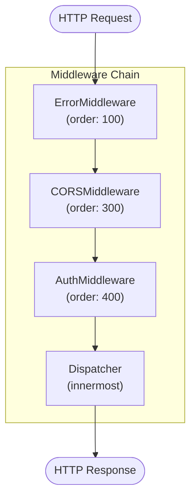
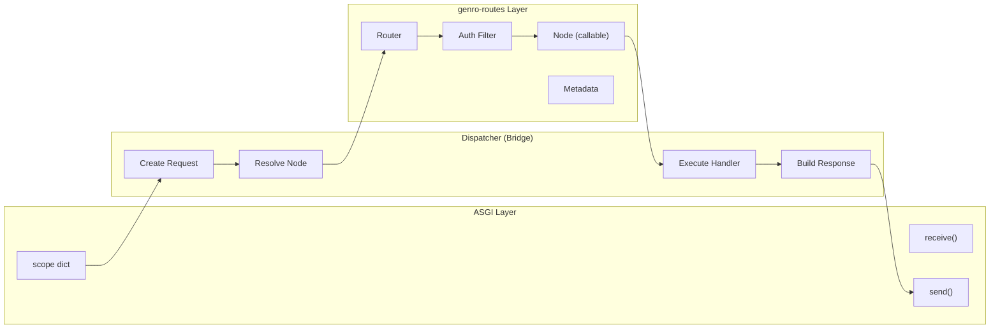
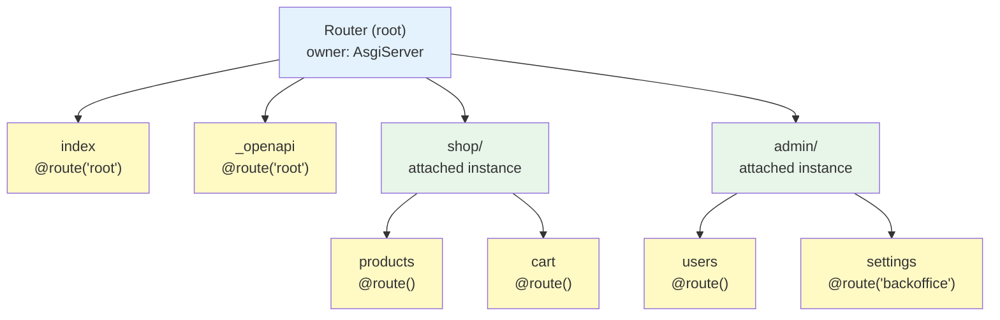
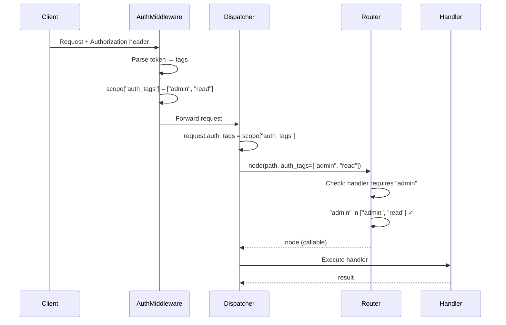
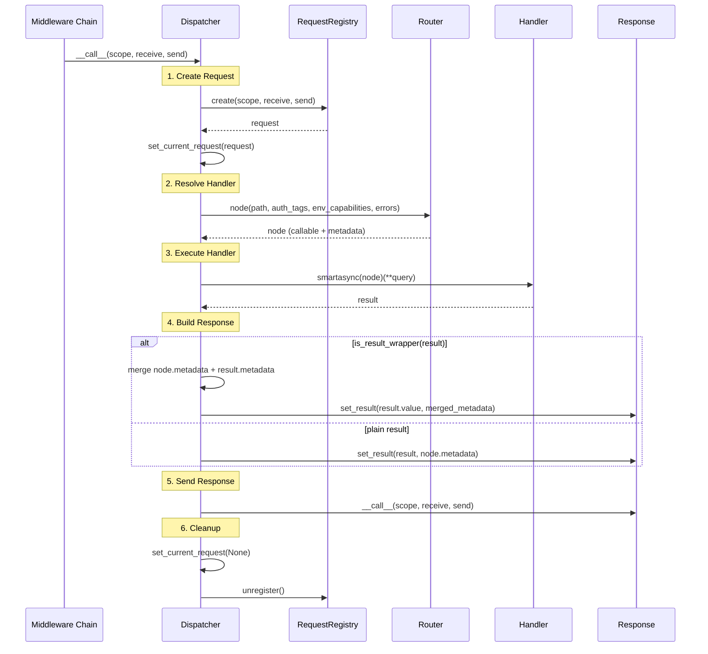

# Dispatcher

The Dispatcher is the innermost layer of the middleware chain. It receives ASGI requests after all middleware processing and routes them to handlers via the genro-routes router.

## Source Location

**File**: `src/genro_asgi/dispatcher.py`

## Dispatcher Class

```python
class Dispatcher:
    """Routes ASGI requests to handlers via genro_routes Router."""

    __slots__ = ("server",)

    def __init__(self, server: AsgiServer) -> None:
        self.server = server

    @property
    def router(self) -> Any:
        """Proxy to server.router."""
        return self.server.router

    @property
    def request_registry(self) -> Any:
        """Proxy to server.request_registry."""
        return self.server.request_registry
```

### Attributes

| Attribute | Type | Description |
| --------- | ---- | ----------- |
| `server` | `AsgiServer` | Semantic reference to server (dual parent-child pattern) |

### Properties (Proxy)

| Property | Proxied From | Description |
| -------- | ------------ | ----------- |
| `router` | `server.router` | genro-routes Router for path resolution |
| `request_registry` | `server.request_registry` | Registry for creating and tracking requests |

## Position in Middleware Chain

The Dispatcher is the innermost ASGI application, wrapped by all middleware:



## Integration with genro-routes

The Dispatcher is the **bridge** between the ASGI world (HTTP protocol) and the genro-routes routing system. This separation is fundamental to the architecture:



### Why genro-routes?

genro-routes is a separate routing library that provides:

| Feature | Description |
| ------- | ----------- |
| `RoutingClass` | Base class for routable objects (AsgiServer, AsgiApplication) |
| `Router` | Container that manages path → handler resolution |
| `@route()` | Declarative decorator for defining endpoints |
| `auth_tags` | Authorization filtering integrated into routing |
| `attach_instance()` | Pattern for building hierarchical routing trees |

### Routing Hierarchy

The genro-routes router builds a **hierarchical tree** of nodes:



### RoutingClass Base

Both `AsgiServer` and `AsgiApplication` extend `RoutingClass`:

```python
from genro_routes import RoutingClass, Router, route

class AsgiServer(RoutingClass):
    def __init__(self, ...):
        self.router = Router(self, name="root")
        # ...
        for name, (cls, kwargs) in config.get_app_specs().items():
            instance = cls(**kwargs)
            self.router.attach_instance(instance, name=name)
```

The `attach_instance()` method:

1. Sets `instance._routing_parent = self`
2. Registers the instance in the router with the specified name
3. Creates a sub-path for all routes of the instance

### @route Decorator

The `@route()` decorator registers methods as endpoints:

```python
class ShopApp(AsgiApplication):
    @route()  # uses default router (self.main)
    def products(self, category: str = None):
        return {"products": [...]}

    @route("main", auth_tags="admin")  # explicit router + auth
    def admin_panel(self):
        return {"admin": True}

    @route(meta_mime_type="text/html")  # metadata for response
    def page(self):
        return "<html>...</html>"
```

### Path Resolution

When the Dispatcher calls `router.node(path, ...)`:

```python
# Request: GET /shop/products?category=electronics
node = self.router.node(
    "/shop/products",           # path to resolve
    auth_tags=["user", "read"], # tags from request (via AuthMiddleware)
    env_capabilities=["can_buy"],
    errors=ROUTER_ERRORS,       # error → exception mapping
)
```

The router:

1. **Path parsing**: `/shop/products` → `["shop", "products"]`
2. **Tree traversal**: root → shop (attached instance) → products (method)
3. **Auth check**: verifies that `["user", "read"]` satisfy node's `auth_tags`
4. **Return node**: callable + metadata (`mime_type`, `cache`, etc.)

### Node Metadata

Node metadata is used by the Dispatcher to configure the response:

```python
@route(meta_mime_type="application/json", meta_cache=3600)
def api_data(self):
    return {"data": [...]}
```

The Dispatcher passes metadata to `response.set_result()`:

```python
request.response.set_result(result, node.metadata)
# → Content-Type: application/json
# → Cache-Control: max-age=3600
```

### Auth Tags Flow

The complete authorization tags flow:



If tags don't satisfy requirements:

```python
@route(auth_tags="superadmin")  # requires "superadmin"
def delete_all(self):
    ...

# Request with auth_tags=["admin", "read"]
# → Router raises errors["not_authorized"] → HTTPForbidden (403)
```

### Separation of Concerns

The separation between Dispatcher and genro-routes enables:

| Component | Responsibility |
| --------- | -------------- |
| **Dispatcher** | ASGI protocol, request/response lifecycle, HTTP error handling |
| **genro-routes** | Path resolution, auth filtering, metadata, tree structure |

Benefits:

- genro-routes can be used standalone (without ASGI)
- The Dispatcher can work with different routers (theoretically)
- Isolated testing: router testable without HTTP, dispatcher testable with mock router

## Request Processing Flow



## ASGI Interface

```python
async def __call__(self, scope: Scope, receive: Receive, send: Send) -> None:
    """ASGI interface - dispatch request to handler via router."""
    request = await self.request_registry.create(scope, receive, send)
    set_current_request(request)

    try:
        node = self.router.node(
            request.path,
            auth_tags=request.auth_tags,
            env_capabilities=request.env_capabilities,
            errors=ROUTER_ERRORS,
        )

        result = await smartasync(node)(**dict(request.query))

        if is_result_wrapper(result):
            metadata = {**node.metadata, **result.metadata}
            request.response.set_result(result.value, metadata)
        else:
            request.response.set_result(result, node.metadata)
        await request.response(scope, receive, send)

    finally:
        set_current_request(None)
        self.request_registry.unregister()
```

### Processing Steps

| Step | Operation | Description |
| ---- | --------- | ----------- |
| 1 | `request_registry.create()` | Creates HttpRequest/MsgRequest from ASGI scope |
| 2 | `set_current_request()` | Sets request in ContextVar for global access |
| 3 | `router.node()` | Resolves path → handler with auth filtering |
| 4 | `smartasync(node)()` | Executes handler (sync or async) with query params |
| 5 | `response.set_result()` | Sets body with auto-detect content-type |
| 6 | `response()` | Sends ASGI response |
| 7 | Cleanup | Resets ContextVar and unregisters request |

## Error Mapping (ROUTER_ERRORS)

The Dispatcher maps router errors to HTTP exceptions via the `ROUTER_ERRORS` dictionary:

```python
ROUTER_ERRORS: dict[str, type[Exception]] = {
    "not_found": HTTPNotFound,
    "not_authorized": HTTPForbidden,
    "not_authenticated": HTTPUnauthorized,
    "not_available": HTTPServiceUnavailable,
    "validation_error": HTTPBadRequest,
}
```

### Error Mapping Table

| Router Error | HTTP Exception | Status Code | When Raised |
| ------------ | -------------- | ----------- | ----------- |
| `not_found` | `HTTPNotFound` | 404 | Path doesn't exist in router |
| `not_authorized` | `HTTPForbidden` | 403 | auth_tags don't authorize access |
| `not_authenticated` | `HTTPUnauthorized` | 401 | Authentication required but missing |
| `not_available` | `HTTPServiceUnavailable` | 503 | Endpoint temporarily unavailable |
| `validation_error` | `HTTPBadRequest` | 400 | Invalid query parameters |

### Router Node Resolution

```python
node = self.router.node(
    request.path,              # e.g., "/shop/products/42"
    auth_tags=request.auth_tags,         # e.g., ["admin", "read"]
    env_capabilities=request.env_capabilities,  # e.g., ["can_write"]
    errors=ROUTER_ERRORS,      # Error → HTTP exception mapping
)
```

The router (genro-routes):

1. Finds the node matching the path
2. Verifies that `auth_tags` satisfy the node's requirements
3. If not authorized, raises the exception from the `errors` mapping
4. Returns the callable node with its metadata

## Handler Execution

### smartasync

`smartasync` (from the smartasync library) allows uniform calling of sync and async handlers:

```python
result = await smartasync(node)(**dict(request.query))
```

Behavior:

- If `node` is `async def`: executes directly
- If `node` is sync `def`: wraps for async execution
- Query parameters passed as kwargs

### Result Wrapper

genro-routes supports `ResultWrapper` for adding metadata to results:

```python
from genro_routes import result_wrapper

@app.route("/products/{id}")
def get_product(id: int):
    product = db.get(id)
    return result_wrapper(product, mime_type="application/json", cache=3600)
```

The Dispatcher handles both cases:

```python
if is_result_wrapper(result):
    # Merge metadata: node defaults + result overrides
    metadata = {**node.metadata, **result.metadata}
    request.response.set_result(result.value, metadata)
else:
    # Plain result: use only node metadata
    request.response.set_result(result, node.metadata)
```

## Request Registry Integration

### RequestRegistry

The `RequestRegistry` creates and tracks active requests:

```python
class RequestRegistry:
    __slots__ = ("_requests", "factories", "_ctx_request")

    def __init__(self, factories: dict[str, type[BaseRequest]] | None = None):
        self._requests: dict[str, BaseRequest] = {}
        self.factories = factories or REQUEST_FACTORIES.copy()
        self._ctx_request: ContextVar[BaseRequest | None] = ...
```

### Request Factories

| Scope Type | Factory Class | Description |
| ---------- | ------------- | ----------- |
| `"http"` | `HttpRequest` | Standard HTTP requests |
| `"websocket"` | `MsgRequest` | WSX messages over WebSocket |

### Request Creation

```python
request = await self.request_registry.create(scope, receive, send)
```

The `create()` method:

1. Determines the type from `scope["type"]`
2. Instantiates the appropriate factory class
3. Calls `await request.init(scope, receive, send)`
4. Registers in `_requests[request.id]`
5. Sets in the local ContextVar

### Request Cleanup

```python
finally:
    set_current_request(None)
    self.request_registry.unregister()
```

Cleanup is guaranteed by the `finally`:

- Resets the global ContextVar
- Removes from registry (based on local ContextVar)

## Response Integration

### Response Creation

The `Response` is automatically created by `BaseRequest.__init__()`:

```python
class BaseRequest(ABC):
    def __init__(self) -> None:
        from .response import Response
        self.response: Response = Response(request=self)
```

### set_result Auto-Detection

```python
request.response.set_result(result, metadata)
```

`set_result()` auto-detects the content-type:

| Result Type | Default Media Type | Notes |
| ----------- | ------------------ | ----- |
| `dict`, `list` | `application/json` | TYTX if `request.tytx_mode` |
| `Path` | From file extension | Via `mimetypes.guess_type()` |
| `bytes` | `application/octet-stream` | Binary data |
| `str` | `text/plain` | Text content |
| `None` | `text/plain` | Empty body |
| other | `text/plain` | Via `str()` conversion |

### Metadata Override

Metadata can specify `mime_type`:

```python
# In route decorator
@app.route("/data", mime_type="text/csv")
def export_data():
    return "col1,col2\n1,2"

# Or in result_wrapper
return result_wrapper(data, mime_type="text/csv")
```

## Current Request Context

### ContextVar

The Dispatcher sets the current request in a global `ContextVar`:

```python
# In request.py
_current_request: ContextVar["BaseRequest | None"] = ContextVar("current_request", default=None)

def get_current_request() -> "BaseRequest | None":
    return _current_request.get()

def set_current_request(request: "BaseRequest | None") -> Any:
    return _current_request.set(request)
```

### Usage

Any code can access the current request:

```python
from genro_asgi import get_current_request

def my_utility():
    request = get_current_request()
    if request:
        user_agent = request.headers.get("user-agent")
```

## Design Decisions

### 1. Semantic Parent Reference

```python
# ✅ Correct - semantic name
self.server = server

# ❌ Wrong - generic name
self._parent = server
```

The name `server` is explicit and self-explanatory.

### 2. Proxy Properties

```python
@property
def router(self) -> Any:
    return self.server.router
```

Proxy properties:

- Keep the interface clean
- Avoid state duplication
- Single source of truth in server

### 3. Query as kwargs

```python
result = await smartasync(node)(**dict(request.query))
```

Query parameters are passed as kwargs:

- Handlers receive typed parameters
- genro-routes can do automatic validation
- Clean syntax in handlers: `def handler(id: int, page: int = 1)`

### 4. Cleanup in finally

```python
try:
    # Processing
finally:
    set_current_request(None)
    self.request_registry.unregister()
```

Cleanup is **always** executed, even on exception.

### 5. Error Mapping via Dict

```python
errors=ROUTER_ERRORS
```

The error mapping is passed to the router as a dict:

- The router doesn't depend on HTTP exception classes
- Easy customization for specific cases
- Separation of responsibilities

## Complete Request Flow Diagram

```mermaid
stateDiagram-v2
    [*] --> ReceiveRequest: ASGI __call__

    state ReceiveRequest {
        [*] --> CreateRequest: registry.create()
        CreateRequest --> SetContext: set_current_request()
        SetContext --> [*]
    }

    ReceiveRequest --> ResolveHandler

    state ResolveHandler {
        [*] --> RouterNode: router.node(path)
        RouterNode --> CheckAuth: auth_tags filter

        CheckAuth --> Authorized: tags match
        CheckAuth --> NotAuthorized: tags don't match

        Authorized --> [*]: return node
        NotAuthorized --> RaiseError: ROUTER_ERRORS mapping
        RaiseError --> [*]: raise HTTPException
    }

    ResolveHandler --> ExecuteHandler: node resolved

    state ExecuteHandler {
        [*] --> SmartAsync: smartasync(node)
        SmartAsync --> CallHandler: **query params
        CallHandler --> GetResult: await/call
        GetResult --> [*]: result
    }

    ExecuteHandler --> BuildResponse

    state BuildResponse {
        [*] --> CheckWrapper: is_result_wrapper?

        CheckWrapper --> MergeMetadata: yes
        CheckWrapper --> UseNodeMetadata: no

        MergeMetadata --> SetResult
        UseNodeMetadata --> SetResult

        SetResult --> AutoDetect: content-type
        AutoDetect --> [*]
    }

    BuildResponse --> SendResponse: response()

    state SendResponse {
        [*] --> StartMessage: http.response.start
        StartMessage --> BodyMessage: http.response.body
        BodyMessage --> [*]
    }

    SendResponse --> Cleanup

    state Cleanup {
        [*] --> ResetContext: set_current_request(None)
        ResetContext --> Unregister: registry.unregister()
        Unregister --> [*]
    }

    Cleanup --> [*]
```



## Related Documents

- [AsgiServer](01_asgi_server.md) - Server containing the Dispatcher
- [Server Lifecycle](03_lifecycle.md) - Startup/shutdown management
- [Request and Response](../04_request_response/01_requests_and_responses.md) - Request and Response classes
- [Middleware Chain](../06_security_and_middleware/01_middleware_chain.md) - Middleware chain
