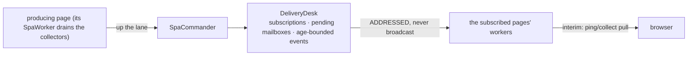

# Datachanges distribution

**Version**: 0.1 · **Last Updated**: 2026-08-22 · **Status**: 🔴 DA REVISIONARE

How a change produced on one page reaches the pages that must see it:
page collectors drain on the worker, delivery is ADDRESSED through the
`DeliveryDesk` — never broadcast, never per-worker snapshots.

Interactions: dbevents (same desk) · global-store · orchestration (the lane carries them).

## The delivery

The last hop is the provisional one: the final design pushes over websocket.
