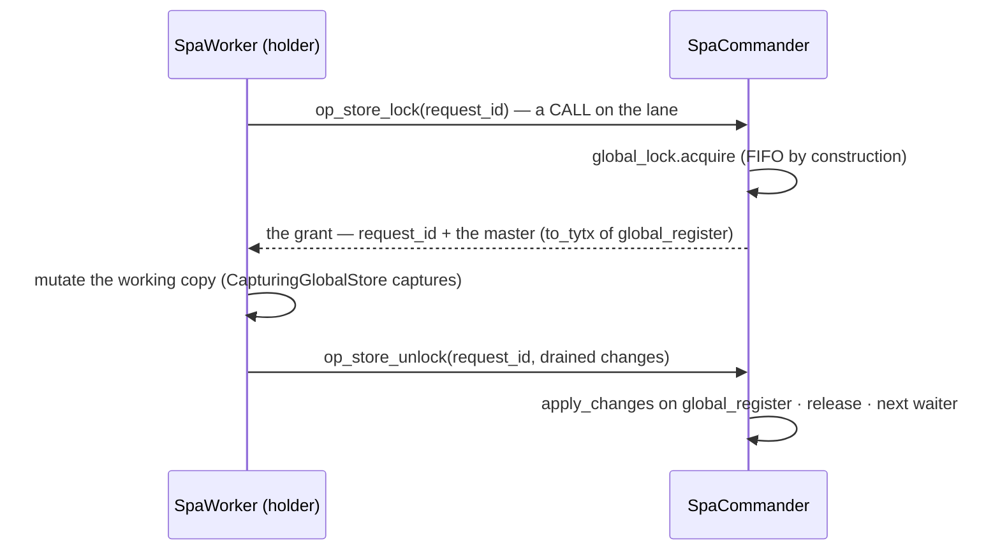

# Global store

**Version**: 0.1 · **Last Updated**: 2026-08-22 · **Status**: 🔴 DA REVISIONARE

One master Bag living ONLY on the commander — no replicas. A worker
reads with a call on the lane (`store_get`), and writes through the lock:
the grant carries the true master state, the release applies exactly what
the holder drained. All-or-nothing without rollback machinery. Never files
or shared memory between processes.

Interactions: orchestration (the lane, the lock) · datachanges (its writes travel as changes).

## The lock: grant and release

A plain read never takes the lock: `store_get` is a CALL answering the
master's current value. A holder that dies (channel EOF) releases with the
master untouched — the interrupted body wrote nothing anywhere.
