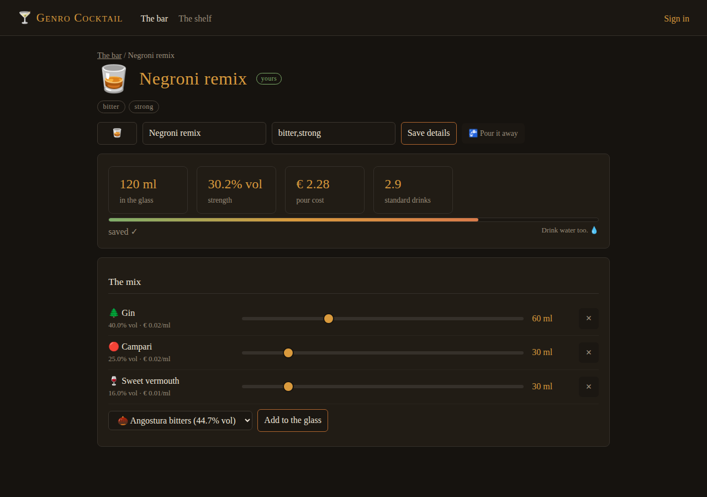

# genro-cocktail — foundation kit

**Status**: seed kit, ready to be lifted into a new repository (`genropy/genro-cocktail`).
**Produced**: 2026-08-12, on branch `claude/genro-cocktail-roadmap-ldcwgz` of `genro-asgi`.

> **Picking up the work? Start from [`HANDOFF.md`](HANDOFF.md)** — intents
> (including the didactic ones), current state, backlog, known traps, and the
> Docker/Kubernetes destination.

## What this is

The theoretical and practical foundations for **genro-cocktail**: a playful
cocktail lab — the classics teach you how cocktails work, sliders let you
bend them into something of your own. The project has three souls: a **game**
(few things, fun), a **showcase** (what the new Genropy stack can do), and a
**laboratory** — the first real consumer application the framework's authors
can tune against and measure with (see the laboratory track in
`docs/PROJECT-PLAN.md`, aimed at the user-sticky worker pool). The stack:

- **genro-asgi** — the ASGI server core (routing, sessions, OIDC social
  login, config), plus a **websocket motor on a server subclass**
- **genro-builders** — server-side HTML generation (the `contrib/html`
  dialect, HTMX-tuned)
- **HTMX** — discrete interactivity (fork, filter, add/remove) without a JS
  build chain; ~70 lines of vanilla JS drive the sliders over the websocket
- **SQLite** — persistence through genro-asgi's `databases` config seam

The intended first audience is Nexus Mixology (nexusmixology.com), as a
demonstration of what the stack can do; the working goal is a small,
polished, fun product.

## Layout

| Path | Contents |
|---|---|
| `docs/GENRO-ASGI-ROADMAP.md` | State of genro-asgi 0.28: what exists, how it works, maturity, what is missing |
| `docs/FEASIBILITY.md` | The verified verdict on HTMX + genro-builders + SQLite + websockets + OAuth on genro-asgi, with every idiom and gotcha |
| `docs/DOMAIN.md` | The concept: the bar, the mixing lab, the shelf, the formula, the rules of the game |
| `docs/PROJECT-PLAN.md` | Milestones to take the prototype to the finished showcase |
| `prototype/` | A **runnable** proof of the whole stack — see below |

## Running the prototype

Requires Python ≥ 3.11:

```bash
pip install genro-asgi websockets     # websockets: uvicorn's ws protocol lib
cd prototype
python serve.py
```

Then open <http://127.0.0.1:8075/>. The database (`cocktail.db`) is created
and seeded with 20 bottles and 10 classics on first boot.
`python smoke.py` runs 30 end-to-end checks (HTTP + websocket) without a
network. HTMX is vendored (`assets/htmx.min.js`) so the demo works offline.

**Social login**: set `GOOGLE_CLIENT_ID` / `GOOGLE_CLIENT_SECRET` (and
`COCKTAIL_EXTERNAL_URL` when public) to arm "Sign in with Google" — the stock
login page builds itself from the configured providers. Anonymous play works
without it: your mixes belong to your session.

What it looks like (`docs/screenshots/`):



What the prototype demonstrates, each one an idiom the real project builds on:

1. **The bar** — classics with taste-tag chips (HTMX filters), emoji, live
   ABV/volume/cost per card; fork-a-classic; invent-from-scratch.
2. **The mixing lab** — a slider per ingredient drives the server-side
   formula (volume, ABV%, pour cost, standard drinks) over a **websocket**,
   with **autosave on every move** when the mix is yours; classics compute
   but never change.
3. **The shelf** — every bottle with its ABV and €/ml, searchable, extensible.
4. **The genro-asgi idioms** — `_request` seam, form-decoding workaround,
   POST guards, static assets with traversal guard, domain-error translation,
   OIDC config, and the `on_websocket` server subclass (see FEASIBILITY).

## Lifting into the new repo

The `prototype/` directory is self-contained (imports only installed
packages). To start `genro-cocktail`: create `genropy/genro-cocktail`, copy
`prototype/` as the package root and `docs/` as the design record, then
follow `docs/PROJECT-PLAN.md` (M0 is exactly this lift). The parent policies
of `meta-genro-modules` apply (English only, no co-author lines, Pre-Alpha
status to start).
