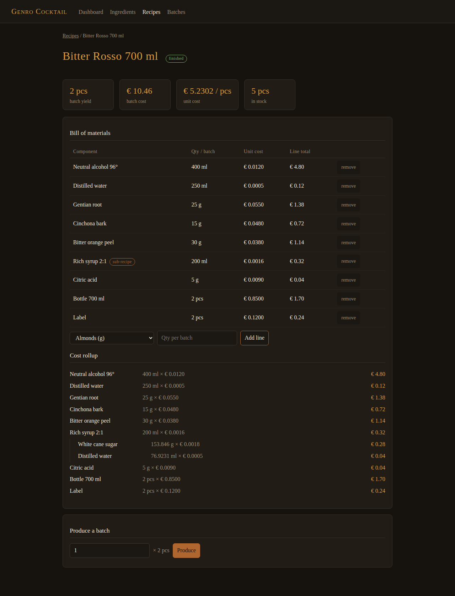

# genro-cocktail — foundation kit

**Status**: seed kit, ready to be lifted into a new repository (`genropy/genro-cocktail`).
**Produced**: 2026-08-12, on branch `claude/genro-cocktail-roadmap-ldcwgz` of `genro-asgi`.

## What this is

The theoretical and practical foundations for **genro-cocktail**: a bill-of-materials
(BOM) management application for a mixology lab — syrups, bitters, premixes,
spirits — built as a showcase of the new Genropy stack:

- **genro-asgi** — the ASGI server core (routing, sessions, auth, config, tasks)
- **genro-builders** — server-side HTML generation (the `contrib/html` dialect)
- **HTMX** — client-side interactivity without a JS build chain
- **SQLite** — persistence through genro-asgi's `databases` config section

The intended first audience is Nexus Mixology (nexusmixology.com), as a
demonstration of what the stack can do; the working goal is a small,
polished, end-to-end product.

## Layout

| Path | Contents |
|---|---|
| `docs/GENRO-ASGI-ROADMAP.md` | State of genro-asgi 0.28: what exists, how it works, maturity, what is missing |
| `docs/FEASIBILITY.md` | The verdict on HTMX + genro-builders + DB on genro-asgi, with every verified idiom and gotcha |
| `docs/DOMAIN.md` | The BOM domain model: entities, invariants, cost rollup, batch production |
| `docs/PROJECT-PLAN.md` | Milestones to take the prototype to the finished showcase |
| `prototype/` | A **runnable** proof of the whole stack — see below |

## Running the prototype

Requires Python ≥ 3.11 and `genro-asgi >= 0.28` (which brings genro-builders,
genro-routes, genro-bag, genro-storage):

```bash
pip install genro-asgi
cd prototype
python -m genro_asgi serve config.py
# or: genro-asgi serve config.py
```

Then open <http://127.0.0.1:8075/>. The database (`cocktail.db`) is created and
seeded on first boot. `python prototype/smoke.py` runs the end-to-end checks
without a network. What it looks like (`docs/screenshots/`):



What the prototype demonstrates, each one an idiom the real project will build on:

1. **HTML pages and fragments built with genro-builders** (`ui/htmx.py`,
   `ui/pages.py`) — typed element tree, automatic escaping, `hx_*` attribute
   ergonomics via a 12-line renderer subclass.
2. **HTMX round-trips** — search-as-you-type over ingredients, inline recipe
   line editing, fragment swaps with `HX-Trigger` headers.
3. **SQLite through the core's `databases` seam** (`db.py`, `config.py`) — a
   thread-safe `db_class` adapter, declared in the config recipe, reached from
   handlers.
4. **Multi-level BOM with recursive cost rollup** — recipes can contain other
   recipes (a syrup base inside a bitter), cost is computed by explosion.
5. **Batch production** — stock check, BOM explosion, stock decrement, batch log.
6. **The genro-asgi idioms that are not obvious** — the `_request` seam, the
   form-decoding workaround, `Redirect` for POST/Redirect/GET, a static-asset
   route with a traversal guard.

## Lifting into the new repo

The `prototype/` directory is self-contained (no imports from this repo's
source tree — only from installed packages). To start `genro-cocktail`:

1. Create `genropy/genro-cocktail`, copy `prototype/` as the package root and
   `docs/` as the design record.
2. Follow `docs/PROJECT-PLAN.md` — milestone 0 is exactly "make this prototype
   the repo skeleton" (pyproject, package layout, tests).
3. The parent policies of `meta-genro-modules` apply (English only, no
   co-author lines, Pre-Alpha status to start).
