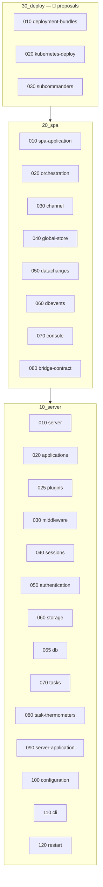
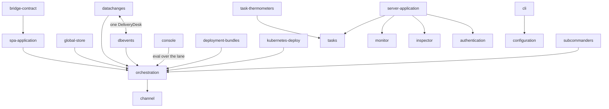

# 00 Overview — how to read this folder

**Version**: 0.3 · **Last Updated**: 2026-08-22 · **Status**: 🔴 DA REVISIONARE

genro-asgi as three worlds, read in order: **10_server** (the machine and
everything an installation runs on), **20_spa** (the SPA world and its
orchestration), **30_deploy** (how installations ship, update and scale —
today entirely unratified proposals). Inside each world the numbered
folders ARE the reading order: no entry needs a concept that comes later.

A **feature** is a human term before a technical one: a need users or
admins have, and our idea to solve it. A few entries are **shelves**
instead — technical strata the features stand on — and say so in their
opening line.

## The four documents

Every entry owns one folder with four documents:

| File | Job |
|---|---|
| `README.md` | the need (or the shelf) in brief, and the flows drawn in mermaid |
| `design.md` | the desired design — everything we want it to be, ratified by the owner |
| `frictions.md` | open problems, kept updated; entries leave only when resolved or explicitly accepted |
| `status.md` | the current state — the entry's local memory, updated in the SAME change that alters the behaviour |

`design.md` and `status.md` deliberately separate what we WANT from what
EXISTS: mixing the two is how documents rot. A claim in `status.md` must be
verifiable in the code; a claim in `design.md` needs no code at all.

## The rules

- **A feature lives where it is born.** Restart is born in the server world;
  what the SPA, the subcommanders or Kubernetes add to it are sections of
  its own documents — never twin folders.
- **Contribution contract, not name-knowledge.** A server-level surface
  (monitor, inspector) grows by CALLING each application for its panel —
  the `app_snapshot`/`app_panel`/`panel_source` style — never by knowing an
  application by name.
- **Forward references only as pointers.** An entry may say "the subject
  lives in ..." and stop; it never explains a concept that a later folder
  owns.
- **Diagrams**: mermaid inside the doc they illustrate; a standalone SVG
  only when mermaid cannot express it. Every named box must exist in the
  code — a diagram with an invented name is worse than no diagram.
- A friction living BETWEEN two entries is recorded in both, same wording.

## The whole building at a glance

## 10_server — the machine, in reading order

| Entry | In one line |
|---|---|
| [010 server](../10_server/010_server/) | the ground: BaseServer, mounted applications, demux D3, lifespan |
| [020 applications](../10_server/020_applications/) | RoutedApplication and the route tree · [openapi](../10_server/020_applications/openapi/) · [mcp](../10_server/020_applications/mcp/) |
| [025 plugins](../10_server/025_plugins/) | capabilities plugged by name, genro-routes entry points |
| [030 middleware](../10_server/030_middleware/) | the uniform ring every request passes |
| [040 sessions](../10_server/040_sessions/) | per-user server-side state between requests |
| [050 authentication](../10_server/050_authentication/) | 401 vs 403 · [avatar](../10_server/050_authentication/avatar/) · [tags](../10_server/050_authentication/tags/) |
| [060 storage](../10_server/060_storage/) | the only door to the filesystem |
| [065 db](../10_server/065_db/) | databases mounted through the recipe, no backend in the core |
| [070 tasks](../10_server/070_tasks/) | work that is no HTTP request |
| [080 task-thermometers](../10_server/080_task-thermometers/) | see a batch move, stop it politely |
| [090 server-application](../10_server/090_server-application/) | the `_server` app and its sections · [monitor](../10_server/090_server-application/monitor/) · [inspector](../10_server/090_server-application/inspector/) |
| [100 configuration](../10_server/100_configuration/) | describe an installation once — every recipe word is defined by now |
| [110 cli](../10_server/110_cli/) | drive installations from the shell |
| [120 restart](../10_server/120_restart/) | born here; enriched by spa → subcommanders → kube |

## 20_spa — the SPA world

| Entry | In one line |
|---|---|
| [010 spa-application](../20_spa/010_spa-application/) | one stable door to the hosted site, no state in the door |
| [020 orchestration](../20_spa/020_orchestration/) | many users with live state, scaled across processes, never split |
| [030 channel](../20_spa/030_channel/) | the wire: frames, hub, the lane (shelf) |
| [040 global-store](../20_spa/040_global-store/) | one shared state, safe read-modify-write |
| [050 datachanges](../20_spa/050_datachanges/) | what one page changes, the others must see |
| [060 dbevents](../20_spa/060_dbevents/) | the database changed a table; the page must learn it |
| [070 console](../20_spa/070_console/) | ask a live pool the questions nobody predicted |
| [080 bridge-contract](../20_spa/080_bridge-contract/) | what genropy-asgi implements and consumes — generalized core, legacy logic in the bridge |

## 30_deploy — shipping, updating, scaling (🔴 proposals)

| Entry | In one line |
|---|---|
| [010 deployment-bundles](../30_deploy/010_deployment-bundles/) | immutable bundles on S3, channels, cohorts, promotion without rebuild |
| [020 kubernetes-deploy](../30_deploy/020_kubernetes-deploy/) | the cluster runs, the commander decides |
| [030 subcommanders](../30_deploy/030_subcommanders/) | delegated authority: root → subcommander → group → worker |

## How the verticals stand on each other

