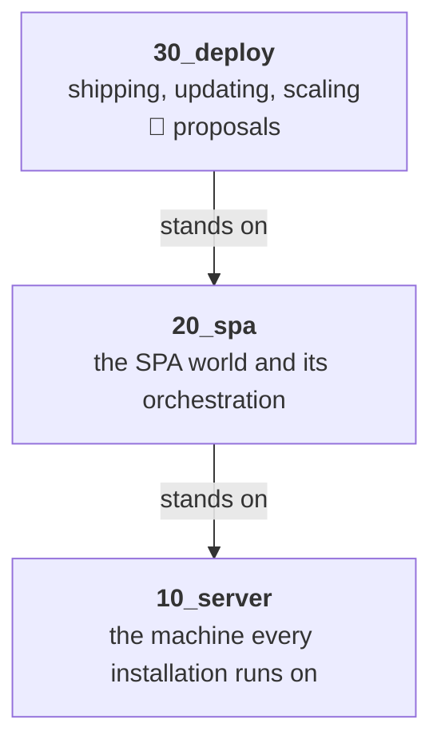
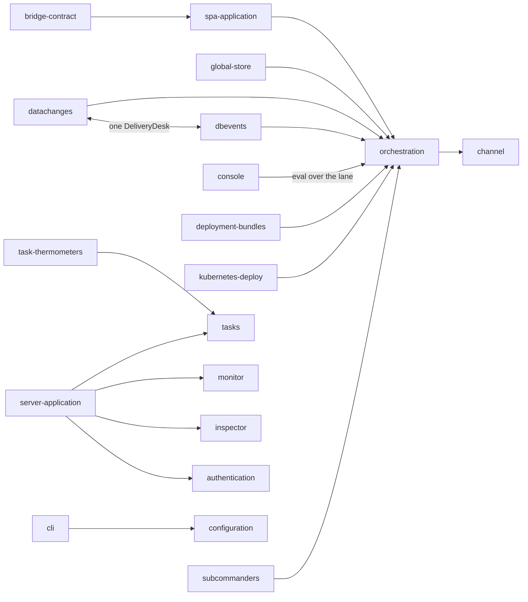

# 00 Overview — how to read this folder

**Version**: 0.4 · **Last Updated**: 2026-08-23 · **Status**: 🔴 DA REVISIONARE

genro-asgi as three worlds, read in order: **10_server** (the machine and
everything an installation runs on), **20_spa** (the SPA world and its
orchestration), **30_deploy** (how installations ship, update and scale —
today entirely unratified proposals). Inside each world the numbered
folders ARE the reading order: no entry needs a concept that comes later.

A **feature** is a human term before a technical one: a need users or
admins have, and our idea to solve it. A few entries are **shelves**
instead — technical strata the features stand on — and say so in their
opening line.

## The documents, and the cycle they serve

An entry is not a folder of notes: it is a **cycle** that carries one subject
from the arrival we want to what is installed, and then repeats. Four roles, in
the order they are written.

| Role | File | Job |
|---|---|---|
| the subject explained | `README.md` | what it is and what it is made of, described in macro-blocks, with the structure drawn in mermaid |
| **1. the arrival** | `design.md` | the finished product, written WITHOUT looking at the code — plus the open frictions at its foot |
| **2. what exists** | `status.md` | the current state, every claim proven in the code |
| **3. the next state** | `steps/step_01/design.md` | the intermediate state this step aims at, expressed as a **diff of what exists** |
| **4. how we reach it** | `steps/step_01/plan.md` | the implementation plan — this entry's part of it |
| the working trail | `tech_notes.md` | for whoever works ON the entry: what decided what, the traps, what the next step needs |

### One tense per document

`README.md` and `design.md` are both written **from the day the work is
finished**: present tense, describing a server that does all of this, with no
"today", no "not yet", no "currently only". A reader must be able to open
them in 2027 and find them simply true. Anything of the form "this is a
current limit", "there is no way to do X yet", "the code has N call sites"
does not belong there — it is `status.md`'s material, and putting it in the
other two is what turns a design into a changelog.

The one exception is the friction tail of `design.md`, which exists precisely
to compare the arrival with the present. That is its job, and it disappears
with the frictions.

`design.md` and `status.md` deliberately separate what we WANT from what
EXISTS: mixing the two is how documents rot. A claim in `status.md` must be
verifiable in the code — `file:line` or the name of the test that proves it.
A claim in `design.md` needs no code at all, and must not be trimmed to fit
the code: it carries its **source** instead — a ratified decision, a commit,
or the owner and a date.

### Who each document is written for

`README.md`, `design.md` and `status.md` are written for someone who wants to
know **the subject** — not for someone curating the dossier. So they carry no
editorial apparatus: no "this entry", no reading-order notes, no
shelf-or-feature label, no cross-reference by block number, nothing about how
the documents themselves work. A reader who opens one page in isolation must
find it complete and never once be told about the folder it lives in.

All of that is real and needed — by us. It lives in **`tech_notes.md`**, the
entry's working trail: the editorial classification, which entries lean on
this one, which register or commit decided what, the things that are easy to
search for and not find, and what whoever writes the next step must know
first. It is the one document addressed to the people building, and the only
one where the dossier may talk about itself.

References to other entries still belong in the three reader-facing
documents — but as a **pointer at the end of a block**, never woven through a
sentence. The description has to stand on its own first.

### The frictions live at the foot of `design.md`

There is no frictions file. A friction is **scaffolding, not a register**: it
exists to produce a question for the interview, and it dies there.

- The audit writes the open frictions as the closing section of `design.md`,
  next to the design they block.
- The interview settles them one at a time, and each answer **deletes or
  shortens** a voice: the section visibly shrinks as the conversation goes.
- Where a friction was born of a contradiction in a source — the
  specification, a decision register, a docstring — settling it **corrects
  that source too**. The correction is part of the answer, not a follow-up.
- When the section is empty, `design.md` can be ratified 🟢.

### Every entry closes with a working configuration

The mechanism of configuration — the tree, its layers, the read stack, the
subscribers and their triggers — is explained once, in
[015 configuration](../10_server/015_configuration/). Every other entry
declares only **what it adds** to that tree, and does it by ending its
`README.md` with a **complete recipe that includes its own feature**: not a
fragment of the section it owns, but a whole installation someone could run,
with its feature in place.

A fragment cannot be checked; a whole recipe can. Which is the point: these are
**executable examples, and they are executed, never proof-read** — the same
rule that caught two broken examples in the published guides.

So the format is fixed even though the check is not written yet:

- one recipe per entry, the LAST section of its `README.md`, under the heading
  `## A configuration that includes it`;
- a single fenced `python` block, self-contained — imports included, one
  `AsgiConfigBuilder` subclass, nothing referenced that the block does not
  define or import;
- it must build: `AsgiServer(config=<that class>)` constructs without raising.

**Owed:** a test that collects every one of those blocks and constructs a
server from each, so a recipe that stops working breaks the suite instead of
rotting unnoticed. Until it exists, the recipes are kept honest by hand — and
the longer that lasts, the less they are worth.

### `design.md` is the fixed pole

Once ratified, **the design does not move.** `status.md` changes with every
delivery, step folders accumulate, the code turns over — and the design stays
exactly where it was. That is what makes it usable as a target: a destination
that drifts is not a destination.

Three things follow.

- **Implementation never edits the design.** A phase that finds itself
  amending `design.md` while building is a phase that has gone wrong: what a
  step aims at belongs to `steps/step_0n/design.md`, and what it achieved
  belongs to `status.md`. If delivering a step really does force a design
  edit, either the step was wrong or the design was — and that is a
  conversation, not a commit.
- **Changing it is changing the destination.** It happens when we change our
  minds about where we are going: an event, deliberate and visible, carrying a
  version bump, a date, and a note of what moved and why — because other
  entries lean on it.
- **The body moves once, before ratification.** Settling a friction can
  rewrite a section; that is the interview doing its job. After 🟢, stillness.

The contrast with `status.md` is the whole point: the status is updated in the
SAME change that alters the behaviour, so it is coupled to every commit; the
design is coupled to none.

### The steps live in their own folders

Three documents stay at the top of an entry, always — `README.md`,
`design.md`, `status.md`. They are what you open to understand the subject,
and their number never grows.

Everything a step needs lives under `steps/`, one folder per step, numbered
and incrementing:

```
010_server/
    README.md        the subject explained
    design.md        the arrival, with its open frictions at the foot
    status.md        what exists today
    steps/
        step_01/
            design.md    the state this step aims at — a diff of status.md
            plan.md      how this entry gets there
        step_02/
            ...
```

An intermediate state is not a different kind of document: it is the same
**design**, at a waypoint — which is why it keeps the name at its own level.
The series converges: every `steps/step_0n/design.md` is a state we would be
content to run in production, each closer to the entry's `design.md` than the
last, and each written as the diff from the `status.md` in force when it was
drafted.

**Delivered steps stay.** When a step is done its state becomes the present
and `status.md` moves; the step folder remains as the road travelled. It costs
nothing, because it never crowded the reading surface to begin with.

**Numbering is per entry.** Entry A may be at its step 3 while entry B is at
its step 1, so step numbers never match across entries — even for one
transversal plan. A step that belongs to a transversal plan names it inside
its own folder; the number alone never carries that link.

### The order of the cycle, and what gates what

1. **Audit.** Writes role 1 (🔴, with its friction tail) and role 2, and the
   interview file in `temp/interview_<entry>.md`. Nothing is ratified here.
2. **Interview.** Settles the frictions, corrects the upstream sources, and
   takes `design.md` to 🟢.
3. **The next step.** `steps/step_0n/design.md` is a diff toward a target, so
   it cannot be written before the entry's `design.md` is ratified.
4. **The plan.** `steps/step_0n/plan.md` follows the step it implements.

Then it repeats: delivering `step_0n` makes `status.md` move, and `step_0n+1`
is written against the new distance from `design.md`.

### The generation ends when the two documents meet

The distance between `design.md` and `status.md` IS the work remaining, entry
by entry. Steps close that distance. When an entry's status has reached its
design, that entry is done; when every entry has, the **generation** is done —
the two documents now say the same thing, one in the voice of the destination
and one with a `file:line` behind every claim.

That is what makes a motionless design livable: it does not stand still
forever, it stands still **for one generation**.

**A new generation duplicates the whole dossier.** The next release is not an
amendment of these documents: `internals/` is copied whole, the designs in the
copy are rewritten toward the new destination, and the designs just reached
become the starting situation the new ones are measured against. Nothing is
thrown away — an arrival becomes a baseline.

`internals/` always names the LIVE generation, and a finished one is archived
under a dated name. Never the other way round: every link and every habit
points at `internals/`, and it is the archive that is opened rarely.

### A plan may be transversal; its local part stays home

One step often touches several entries at once and needs them adapted
together. So a plan can be transversal — but **each entry keeps its own part
of it in its own step folder**, which names the transversal plan it serves.

The **coordinator** puts the sub-plans together, checks that they are
harmonious and coherent, and only then launches a workflow. It is the one
role that reads across entries: everything else in this dossier is written
from inside a single one. The assembly point today is `.phased/roadmap.md`.

## The rules

- **Static is never a goal.** Where a design says something is fixed at boot,
  fixed at construction, or changeable only by restart, it says WHY it could
  not be made dynamic. Immobility is a limit we have not yet removed, never a
  property to celebrate. *(Owner, 2026-08-23. Where this principle finally
  gets written — here, in the specification, or in the coding rules — is
  itself an open friction in `10_server/010_server/design.md`, S4.)*
- **A feature lives where it is born.** Restart is born in the server world;
  what the SPA, the subcommanders or Kubernetes add to it are sections of
  its own documents — never twin folders.
- **Contribution contract, not name-knowledge.** A server-level surface
  (monitor, inspector) grows by CALLING each application for its panel —
  the `app_snapshot`/`app_panel`/`panel_source` style — never by knowing an
  application by name.
- **Anticipate a reason; never rebuild a mechanism.** When something that
  comes later is the *motive* for a choice made here, say so and say enough of
  it to make the choice make sense — a design whose reasons live elsewhere
  reads as arbitrary, and arbitrary is unreviewable. What stays off-limits is
  the later subject's *machinery*: explain why the identity of an application
  must be stable, not how the command that changes the installed set works.
  The test is whether the page still reads as complete to someone who stops
  here. *(Owner, 2026-08-23, amending the earlier "forward references only as
  pointers", which made choices look unmotivated.)*
- **Diagrams**: mermaid inside the doc they illustrate; a standalone SVG
  only when mermaid cannot express it. Every named box must exist in the
  code — a diagram with an invented name is worse than no diagram.
- A friction living BETWEEN two entries is recorded in both, same wording,
  and settled once for both.

## The whole building at a glance

Three worlds, each standing on the one below. What lives inside each is the
three tables that follow — a diagram of those lists would only redraw them.



## 10_server — the machine, in reading order

| Entry | In one line |
|---|---|
| [010 server](../10_server/010_server/) | the ground: BaseServer, mounted applications, demux D3, lifespan |
| [015 configuration](../10_server/015_configuration/) | the tree every entry reads its own words from: layers, read stack, subscribers |
| [020 applications](../10_server/020_applications/) | RoutedApplication and the route tree · [openapi](../10_server/020_applications/openapi/) · [mcp](../10_server/020_applications/mcp/) |
| [025 plugins](../10_server/025_plugins/) | capabilities plugged by name, genro-routes entry points |
| [030 middleware](../10_server/030_middleware/) | the uniform ring every request passes |
| [040 sessions](../10_server/040_sessions/) | per-user server-side state between requests |
| [050 authentication](../10_server/050_authentication/) | 401 vs 403 · [avatar](../10_server/050_authentication/avatar/) · [tags](../10_server/050_authentication/tags/) |
| [060 storage](../10_server/060_storage/) | the only door to the filesystem |
| [065 db](../10_server/065_db/) | databases mounted through the recipe, no backend in the core |
| [070 tasks](../10_server/070_tasks/) | work that is no HTTP request |
| [080 task-thermometers](../10_server/080_task-thermometers/) | see a batch move, stop it politely |
| [090 server-application](../10_server/090_server-application/) | the `_server` app and its sections · [monitor](../10_server/090_server-application/monitor/) · [inspector](../10_server/090_server-application/inspector/) |
| [110 cli](../10_server/110_cli/) | drive installations from the shell |
| [120 restart](../10_server/120_restart/) | born here; enriched by spa → subcommanders → kube |

## 20_spa — the SPA world

| Entry | In one line |
|---|---|
| [010 spa-application](../20_spa/010_spa-application/) | one stable door to the hosted site, no state in the door |
| [020 orchestration](../20_spa/020_orchestration/) | many users with live state, scaled across processes, never split |
| [030 channel](../20_spa/030_channel/) | the wire: frames, hub, the lane (shelf) |
| [040 global-store](../20_spa/040_global-store/) | one shared state, safe read-modify-write |
| [050 datachanges](../20_spa/050_datachanges/) | what one page changes, the others must see |
| [060 dbevents](../20_spa/060_dbevents/) | the database changed a table; the page must learn it |
| [070 console](../20_spa/070_console/) | ask a live pool the questions nobody predicted |
| [080 bridge-contract](../20_spa/080_bridge-contract/) | what genropy-asgi implements and consumes — generalized core, legacy logic in the bridge |

## 30_deploy — shipping, updating, scaling (🔴 proposals)

| Entry | In one line |
|---|---|
| [010 deployment-bundles](../30_deploy/010_deployment-bundles/) | immutable bundles on S3, channels, cohorts, promotion without rebuild |
| [020 kubernetes-deploy](../30_deploy/020_kubernetes-deploy/) | the cluster runs, the commander decides |
| [030 subcommanders](../30_deploy/030_subcommanders/) | delegated authority: root → subcommander → group → worker |

## How the verticals stand on each other


