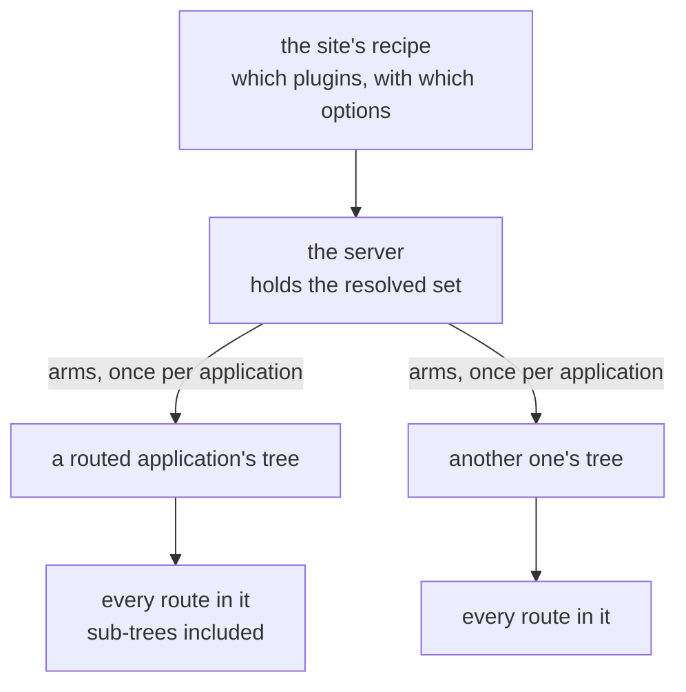

# Plugins

**Version**: 0.3 · **Last Updated**: 2026-08-23 · **Status**: 🔴 DA REVISIONARE

How a capability is added to what a route tree does, without editing the tree,
the handlers, or the server.

## What a plugin is

An application's routes are methods, and a method says what it computes. It
does not say who may call it, what its parameters mean to a schema generator,
or whether the call should be logged. Those are questions asked *about* a
route rather than answered *by* it, and every one of them applies to routes
that were written independently, by people who never agreed on anything.

A **plugin** answers one such question for every route in a tree at once. It
reads what the tree already knows — the handler's name, its parameters, the
options written beside it — and contributes something the tree did not have:
a filter, a description, a piece of metadata. Handlers are not edited, and the
plugin does not know one from another.

Three things it is not, and each confusion costs something real.

**Not a middleware.** A middleware wraps the dispatch and sees every request
of the whole server, including those for applications with no routes at all. A
plugin sees the *tree* and none of the traffic. One is a ring around the door,
the other a property of the map. Two consequences make the test sharp: a
plugin can say things about a route nobody has called yet, and a middleware
can answer a request no route matched.

**Not the mixin that provides plugins.** The machinery — the resolved set, the
registry, the arming — is a capability layer of the server, stacked on the
server class like the others. A plugin is what that machinery installs. The
two are one word apart and one level apart, and this page uses *plugin* only
for the installed thing.

**Not an application.** It answers no request and has no mount.

## The anatomy



| The part | In one line |
|---|---|
| what a plugin reads and adds | the contract it satisfies |
| where plugins come from | three sources, one namespace |
| the fixed pair | what is structure, and what is a choice |
| when a tree is armed | once, on the first look after installation |
| what a site writes | the section, and the options beside a route |
| writing one | the base class, the five hooks, and how it is installed |

---

## 1. What a plugin reads, and what it adds

A tree can describe itself: for every route it knows the name, the declared
parameters and their types, the options written at the route, and the
sub-trees below. That description is **neutral** — it names no protocol and no
plugin.

A plugin is a reader of that description, and it can contribute in two ways.

It can **withhold a route**, by giving a reason why a particular caller may
not have it. Authorization works this way: the resolution fails, no handler
code is consulted, and the reason travels with the failure — so a route
withheld is not confused with a route that does not exist. A caller who
presented nothing is told to identify themselves; one whose grants are not
enough is refused. Those two answers, and the distinction between them, belong
to [020 applications](../020_applications/).

It can **add metadata**, which travels with the route and is read by whoever
publishes or dispatches it. The schema face of an application is built
entirely from what plugins contributed this way.

A plugin may do both, or neither and something else — the full set of hooks is
in block 6.

A plugin reads options written **beside a route**, and the convention is one
word: the plugin's name, an underscore, the option.

```python
@route(openapi_method="delete", openapi_tags="admin")
def drop(self, item_id: int) -> dict: ...
```

That route is published as a `DELETE`, tagged `admin`. The handler body knows
nothing about it. An option whose value is naturally plural takes a list —
`openapi_tags=["admin", "catalogue"]` — and a single one may be written bare.

**What is published is a description, not a constraint.** The verb beside the
route is what the schema will say; the dispatch does not read it, so the route
answers whatever verb reaches it. Nothing here turns a published `DELETE` into
a refusal of a `GET`.

---

## 2. Where plugins come from — three sources, one namespace

A plugin is named by a short **code**, and a site writes that code and nothing
else. Behind the code the class comes from one of three places.

**The routing library ships five**, the ones about routing itself: `auth`
(authorization), `pydantic` (signature reading), `logging`, `channel` and
`env`. They need no class from anybody — naming the code is enough, because
the library already knows them.

**This package ships the dialect plugins.** A dialect is a way of *publishing*
a tree rather than a way of routing it, so it does not belong to the routing
library. Today there is one, `openapi`. Its class comes from a small default
mapping the server builds for itself at construction.

**A site brings its own.** A capability nobody anticipated arrives as a class,
handed to the server, and merged over that mapping under its own code. Block 6
is how one is written.

The three share one namespace, and a code that resolves to nothing **stops the
arming with an error** naming it and listing what is available. Silence would
be the wrong answer here, because a capability that failed to arm leaves no
trace: a filter that never filters looks exactly like a tree with nothing to
hide, and the absence is noticed only by whoever was already looking for it.

> The dialect this package ships is described where it is consumed:
> [020 applications / openapi](../020_applications/openapi/).

---

## 3. The fixed pair, and what is a choice

Two plugins are **structure, not configuration**: the one that reads handler
signatures, and the one that carries the per-route publishing controls. Every
server arms both on every application it hosts, and a site cannot switch either
off — asking to is an error, not an opt-out.

The reason is that a control which only works when a capability happens to be
enabled is a control nobody can rely on. If the publishing options beside a
route were honoured on some installations and ignored on others, reading a
route would no longer tell you how it behaves, and the words at the route
would have to be checked against a configuration file every time.

A third is always present too, and it arrives differently: the application
arms the **authorization** plugin on its own tree, for itself, in its own
constructor. It does not wait for a server to do it — an application embedded
in a server with no plugin machinery at all still filters its protected routes.

Everything beyond those three is a site's choice: named in the configuration,
armed if named, absent if not.

---

## 4. When a tree is armed

Arming happens **once per application, at the first look at its tree after the
server has installed it**. Not when the module is imported, not while the
application is being built, not per request.

The lateness is the point. An application is built before it belongs to
anybody, so at that moment there is no server to ask which plugins to arm.
Waiting until the tree is first read means the answer exists by then, and
nothing has to be sequenced by hand.

It has a visible consequence: a server that has finished booting has **not yet
armed anything**. Until something looks at an application's tree, that tree
carries only what the application armed for itself, and the server's set
arrives on the first look. A reader who inspects a freshly booted installation
and finds one plugin where they expected three is seeing this, not a fault.

**Arming twice is safe by design, not by luck.** A tree already carrying a
plugin does not receive it a second time, and a class already known to the
routing library is not registered again. So nothing anywhere has to remember
whether a given look was the first, and a debugging line that touches a tree
cannot change what an installation does.

---

## 5. What a site writes

One section of the description, one entry per plugin, each labelled by its
code:

```python
plugins = cfg.plugins()
plugins.plugin(code="logging")
plugins.plugin(code="openapi", security_scheme="ApiKeyAuth")
```

An entry with no options enables the plugin. Options beside the code become
the plugin's own settings for the whole tree, which the words beside a single
route then override for that route. And `enabled=False` removes a plugin a
site does not want — one of its own choices, never one of the fixed pair.

The section is the **server's**, so what it names is armed on every routed
application the server hosts.

> The section's place in the description, and how a value is read back, is
> [015 configuration](../015_configuration/).

---

## 6. Writing one

A plugin is a subclass of the routing library's `BasePlugin`, with two class
attributes — the **code** it will be named by, and a description — and as many
of five hooks as it needs. All five are optional; a plugin that implements none
is legal and does nothing.

| Hook | When it runs | What it is for |
|---|---|---|
| `configure(**options)` | at arming, and again per route | **declares the words** a route may write beside itself; its parameters *are* the accepted options, and it stores nothing — the base class does |
| `entry_metadata(router, entry)` | when the tree is described | returns a dict that travels with the route, for whoever publishes it |
| `deny_reason(entry, **filters)` | during resolution | returns a reason the route is not available to this caller; this is the hiding half |
| `on_decore(router, func, entry)` | when a route is registered | see the route as it joins the tree |
| `wrap_handler(router, entry, call_next)` | around every call | wrap the handler itself |

Read the options back with `self.configuration(entry.name)`, which merges what
was written at the route over what was written for the whole tree.

```python
from genro_routes.plugins._base_plugin import BasePlugin


class OwnerPlugin(BasePlugin):
    """Names the team responsible for a route."""

    plugin_code = "owner"
    plugin_description = "Names the team responsible for a route"

    def configure(self, team: str = "", oncall: str = "") -> None:
        """The words a route may write: owner_team, owner_oncall."""

    def entry_metadata(self, router, entry) -> dict:
        cfg = self.configuration(entry.name)
        if not cfg.get("team"):
            return {}
        return {"owner": {"team": cfg["team"], "oncall": cfg.get("oncall", "")}}
```

A route then writes `@route(owner_team="retail")`, and the description of that
route carries the contribution under the plugin's own code.

**Installing it takes two things, and both are needed.** The class reaches the
server as a construction argument, and the code is named in the description
like any other:

```python
server = AsgiServer(config=ServerConfiguration, plugin_registry={"owner": OwnerPlugin})
```

```python
cfg.plugins().plugin(code="owner")
```

The asymmetry is worth noticing: the class cannot travel in the description.
A site with a plugin of its own builds its server in Python, where a site using
only the plugins that already exist does not.

---

## A configuration that includes it

A whole installation that adds one plugin by name, tunes one of the fixed
pair, and carries a route that tells the publishing plugin how it wants to
appear.

```python
import tempfile

from genro_routes import route

from genro_asgi import AsgiServer, RoutedApplication
from genro_asgi.config import BaseConfiguration


class Catalogue(RoutedApplication):
    """Two handlers, one of them telling the openapi plugin how to publish it."""

    mount = ""

    @route()
    def search(self, q: str = "") -> dict[str, str]:
        """Find something."""
        return {"found": q}

    @route(openapi_method="delete", openapi_tags="admin")
    def drop(self, item_id: int) -> dict[str, int]:
        """Remove an item."""
        return {"deleted": item_id}


# The local storage backend refuses a directory that is not there; a real
# deployment names its own.
SITE_DIR = tempfile.mkdtemp(prefix="catalogue-")


class ServerConfiguration(BaseConfiguration):
    """A site that adds one plugin by name and tunes one of the fixed pair."""

    def main(self, root):
        cfg = root.configuration()
        self.server_section(cfg)
        self.storage_section(cfg)
        cfg.applications().application(code="catalogue", app_class=Catalogue)
        plugins = cfg.plugins()
        plugins.plugin(code="logging")
        plugins.plugin(code="openapi", security_scheme="ApiKeyAuth")

    def storage_mounts(self, section):
        section.local(name="site", base_path=SITE_DIR)


server = AsgiServer(config=ServerConfiguration)
```

`BaseConfiguration` is the package's own defaults written as a recipe, and
`server_section` / `storage_section` are two of its hooks — which is why `main`
calls two methods it does not define, and defines a third (`storage_mounts`)
that the inherited `storage_section` calls. That mechanism belongs to
[015 configuration](../015_configuration/).

Asked about itself, the installation answers — and every question below is an
expression you can type, given
`route = server.applications["catalogue"].route` and
`spec = router_openapi(route)`:

| Asked | Answer |
|---|---|
| `sorted(server.plugins)` | `['logging', 'openapi', 'pydantic']` |
| `server.plugins["openapi"]` | `{'security_scheme': 'ApiKeyAuth'}` |
| `sorted(p.name for p in route.iter_plugins())` | `['auth', 'logging', 'openapi', 'pydantic']` |
| `{p: sorted(o) for p, o in spec["paths"].items()}` | `{'/search': ['get'], '/drop': ['delete']}` |
| `spec["paths"]["/drop"]["delete"]["tags"]` | `['admin']` |

Four things there are worth reading twice.

**The resolved set is three, and only one of them is an addition.** The recipe
named `logging` and `openapi`; the second was going to be there anyway, and
naming it only tuned it. `pydantic`, which the recipe never mentions, is the
other half of the fixed pair.

**The armed set is four.** `auth` is on the tree because the application put it
there itself, not because the server did.

**The first line is doing work.** Reading `.route` is what triggers arming; ask
`iter_plugins` on a tree nobody has looked at yet and the answer is `['auth']`.

**`/drop` is published as a `DELETE`** because of the two words beside that one
route, while `/search` kept the verb guessed from its signature. Guessed or
declared, neither constrains what the server will actually answer.

`router_openapi` is the OpenAPI reader of the tree, and it works on any armed
tree without an OpenAPI application being mounted. It belongs to
[020 applications / openapi](../020_applications/openapi/).

## What stands on this

The OpenAPI face of an application and the tool face for models are both built
by reading metadata plugins contributed, so both rest on this. Authorization
uses the filtering half, and the dispatch of every routed application reads the
signatures the fixed pair captured.
