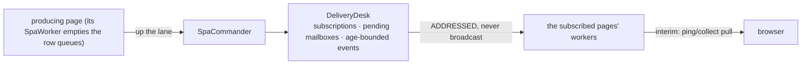

# Datachanges distribution

**Version**: 0.1 · **Last Updated**: 2026-09-02 · **Status**: 🔴 DA REVISIONARE

**The need.** What one page changes, the other pages that care must see — without every page polling the world.

How a change produced on one page reaches the pages that must see it:
a page's queue empties on the worker, delivery is ADDRESSED through the
`DeliveryDesk` — never broadcast, never per-worker snapshots.

**Where a page's own changes are queued.** The page register row carries
`datachanges` and `datachanges_idx`. `RegisterRegistry.subscribe_page_store`
attaches to the row's store a subscriber under the id
`page_store:<register_item_id>`: every update, insert, delete and transaction
mutation whose path falls under a prefix in `page["subscribed_paths"]` is
appended to `datachanges` with `key.reason == "serverChange"`, autocreated
parents skipped, prefixes matched segment-aware. `SpaWorker.collect_page`
empties the queue and resets the index. The queue is a row field, so it travels
in the parcel through a freeze and a transfer. Every access to a row and to its
Bag takes the row's exclusive re-entrant `item_lock`. The user store keeps its
`user_view` — another round.

Interactions: dbevents (same desk) · global-store · orchestration (the lane carries them).

## The delivery

The last hop is the provisional one: the final design pushes over websocket.
