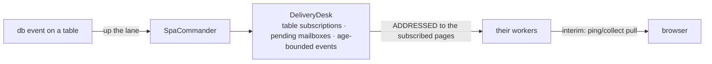

# Table subscriptions and dbevents

**Version**: 0.1 · **Last Updated**: 2026-08-22 · **Status**: 🔴 DA REVISIONARE

**The need.** A page shows a table; when the database changes that table, the page must learn it — even if the writer was a batch or another user.

A page subscribes to tables; a database event is delivered to the
subscribed pages through the `DeliveryDesk`: subscriptions, pending
mailboxes for pages between two homes, age-bounded events.

Interactions: datachanges (same desk) · orchestration (mobility must not lose a pending event).

## The delivery

A page between two homes does not lose its events: they wait in the pending
mailbox, bounded by age.
