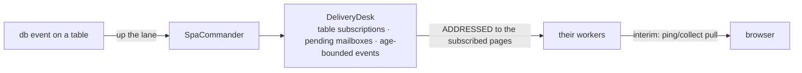

# Table subscriptions and dbevents

**Version**: 0.2 · **Last Updated**: 2026-09-02 · **Status**: 🔴 DA REVISIONARE

**The need.** A page shows a table; when the database changes that table, the page must learn it — even if the writer was a batch or another user.

A page subscribes to tables; a database event is delivered to the
subscribed pages through the `DeliveryDesk`: subscriptions, pending
mailboxes for pages between two homes, age-bounded events.

Interactions: datachanges (same desk) · orchestration (mobility must not lose a pending event).

## The delivery

A page between two homes does not lose its events: they wait in the pending
mailbox, bounded by age.

## How a worker knows the subscribed tables, and when it delivers

The worker filters the commits of its site with its own `subscribed_tables`,
which only the commander writes: on every transition of the global set — the
first subscriber of a table, the last one gone — `broadcast_subscribed_tables`
pushes the whole set to every living worker through the `/op/subscribed_tables`
CALL, and a newborn worker receives it at its first presentation. No reply of
`subscribe_table` or `exchange` carries a table list.

The deposits of a request leave the worker in two ways. `collect_page` carries
them to the answering page and retires that page's queues. What the collect did
not carry — a `rootPage` webhook, a request that failed after its commit — is
sent up `/desk/deposit` at the end of every request, which files the deposits in
the subscribers' queues and retires nothing: there is no page to answer.
