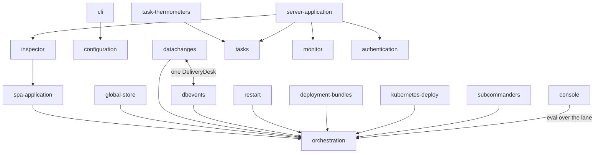

# Internals — layers and features

**Version**: 0.2 · **Last Updated**: 2026-08-22 · **Status**: 🔴 DA REVISIONARE

genro-asgi read as a building: horizontal **layers** (the technical shelves
the system stands on) and vertical **features** that cross them. A feature
is a HUMAN term before a technical one: a need users or admins have, and
our idea to solve it. A layer answers no need by itself — it is what the
features stand on.

Each layer and each feature owns one folder with four documents:

| File | Job |
|---|---|
| `README.md` | the need (or the shelf), in brief — and the flows drawn in mermaid |
| `design.md` | the desired design — everything we want it to be, ratified by the owner |
| `frictions.md` | open problems and frictions, kept updated; entries leave only when resolved or explicitly accepted |
| `status.md` | the current state — the feature's local memory, updated in the SAME change that alters the behaviour |

`design.md` and `status.md` deliberately separate what we WANT from what
EXISTS: mixing the two is how documents rot. A claim in `status.md` must be
verifiable in the code; a claim in `design.md` needs no code at all.

**Diagrams**: flows, steps and the registers involved are drawn as mermaid
blocks inside the doc they illustrate (GitHub renders them natively); a
standalone SVG beside the doc only when mermaid cannot express it. Every
named box must exist in the code — a diagram with an invented name is worse
than no diagram.

## The layers (horizontal)

| Layer | The shelf |
|---|---|
| [010 channel](layers/010_channel/) | frames on Unix sockets, the hub, the lane |
| [020 storage](layers/020_storage/) | the only door to the filesystem |
| [030 middleware](layers/030_middleware/) | the uniform ring every HTTP request passes |
| [040 routing](layers/040_routing/) | the route tree and its API faces (REST/OpenAPI, MCP) |
| [050 sessions](layers/050_sessions/) | per-user server-side state between requests |

## The features (vertical)

| Feature | The need |
|---|---|
| [configuration](features/010_configuration/) | describe an installation once, start it by name |
| [cli](features/015_cli/) | drive installations from the shell |
| [authentication](features/020_authentication/) | only the right people get in; 401 vs 403 |
| [server-application](features/030_server-application/) | one place where the server is administered |
| [monitor](features/040_monitor/) | "what is my server doing right now?" — one page |
| [inspector](features/050_inspector/) | look into the SPA fronts of a live installation |
| [console](features/060_console/) | ask a live pool the questions nobody predicted |
| [tasks](features/070_tasks/) | work that is no HTTP request: schedules, batches, spool |
| [task-thermometers](features/080_task-thermometers/) | see a batch move, stop it politely |
| [spa-application](features/090_spa-application/) | one stable door to the hosted site, no state in the door |
| [orchestration](features/100_orchestration/) | many users with live state, scaled across processes, never split |
| [global-store](features/110_global-store/) | one shared state, safe read-modify-write |
| [datachanges](features/120_datachanges/) | what one page changes, the others must see |
| [dbevents](features/130_dbevents/) | the database changed a table; the page must learn it |
| [restart](features/140_restart/) | restart the server without betraying who is working |
| [deployment-bundles](features/150_deployment-bundles/) | 🔴 proposal: test with named users, promote the accepted build as is |
| [kubernetes-deploy](features/160_kubernetes-deploy/) | 🔴 proposal: the cluster runs, the commander decides |
| [subcommanders](features/170_subcommanders/) | 🔴 proposal: delegated authority at scale |

## The grid — which feature crosses which layer

| feature \ layer | channel | middleware | routing | sessions | storage |
|---|---|---|---|---|---|
| configuration | | | ✓ | | ✓ |
| authentication | | ✓ | ✓ | ✓ | |
| server-application | | ✓ | ✓ | | |
| monitor | | | ✓ | | |
| inspector | | | ✓ | | |
| console | ✓ | | ✓ | | |
| tasks | | | ✓ | | ✓ |
| task-thermometers | | | ✓ | | ✓ |
| spa-application | | ✓ | ✓ | | |
| orchestration | ✓ | | | | ✓ |
| global-store | ✓ | | | | |
| datachanges | ✓ | | | | |
| dbevents | ✓ | | | | |
| restart | ✓ | | | ✓ | ✓ |
| deployment-bundles | ✓ | | | | ✓ |
| cli | | | | | ✓ |
| kubernetes-deploy | ✓ | | | | ✓ |
| subcommanders | ✓ | | | | ✓ |

Features also stand on each other — the tall verticals of the SPA world all
pass through **orchestration**:

A friction that lives BETWEEN two entries is recorded in both, with the
same wording.
