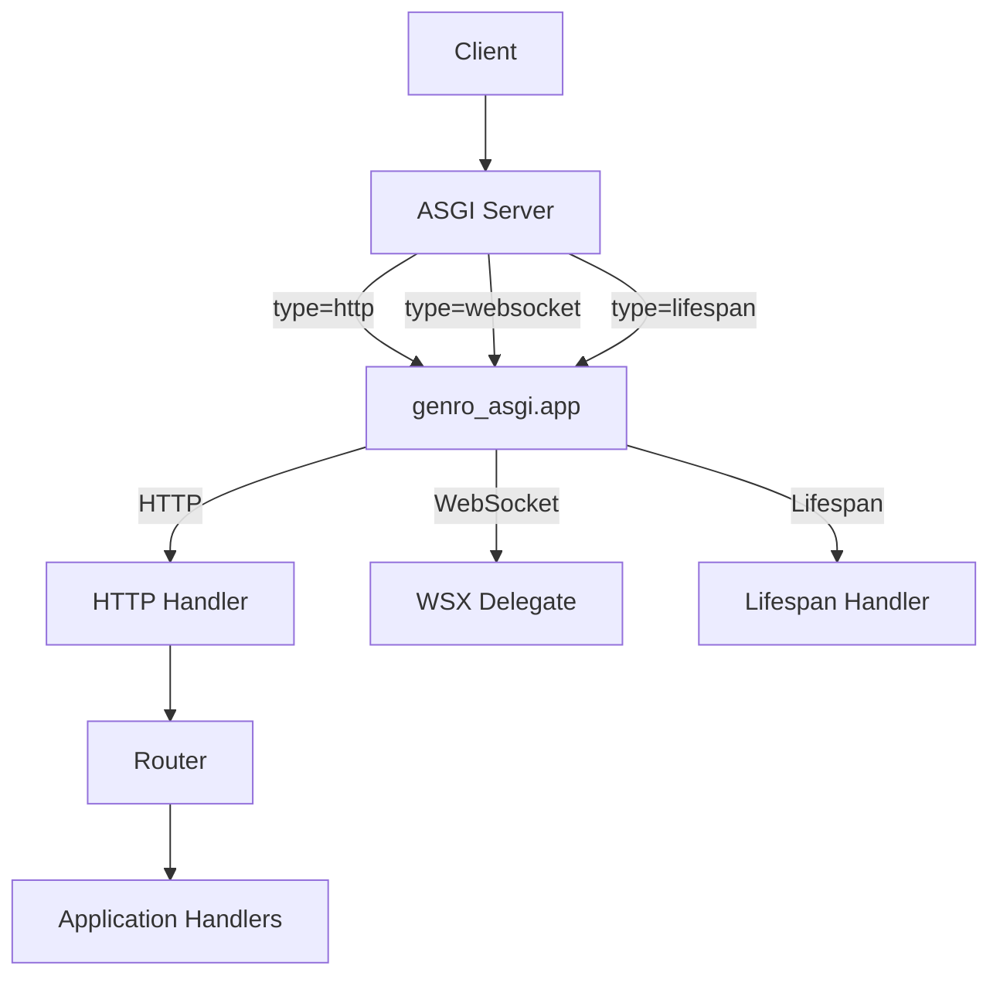
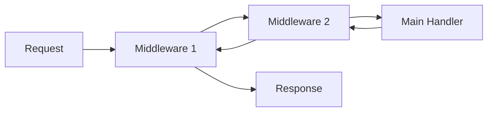
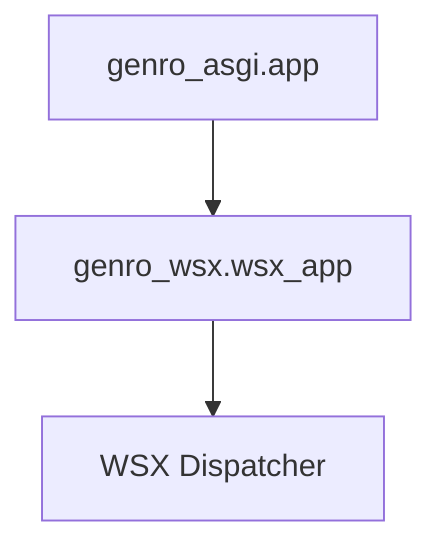

# Genro-ASGI — Complete Specification and Implementation Guide

This document is a **technical reference** and **implementation guide** for `genro-asgi`.  
All content is written in clear English and contains **no emojis**.

---

# 1. Purpose of Genro-ASGI

Genro-ASGI is a minimal, stable ASGI layer designed to serve as the foundation of the Genro ecosystem.  
Its main goals are:

- Provide clean and predictable HTTP request/response handling.
- Integrate WebSocket support by delegating to Genro-WSX.
- Offer a small, maintainable routing system.
- Support a simple and composable middleware chain.
- Centralize error handling.
- Support essential static file serving.
- Implement ASGI lifespan events.

Design values:

- Minimal surface area.
- Zero hidden magic.
- Predictable and explicit behavior.
- Tight integration with higher layers (Genro-WSX, genro-api, SmartRouter).

---

# 2. High-Level Architecture



Main components:

- Application dispatcher `app(scope, receive, send)`
- HTTP subsystem
- WebSocket delegation
- Lifespan handling
- Router
- Middleware
- Error Management

---

# 3. ASGI Core: Application Dispatcher

```python
async def app(scope, receive, send):
    scope_type = scope.get("type")

    if scope_type == "http":
        response = await http_app(scope, receive)
        await response(scope, receive, send)

    elif scope_type == "websocket":
        await ws_app(scope, receive, send)

    elif scope_type == "lifespan":
        await lifespan_app(scope, receive, send)

    else:
        await send({
            "type": "http.response.start",
            "status": 500,
            "headers": []
        })
        await send({
            "type": "http.response.body",
            "body": b"Unsupported scope type"
        })
```

---

# 4. Request and Response Layer

## 4.1 Request Implementation

Example file: `genro_asgi/request.py`

```python
import urllib.parse

class Request:
    def __init__(self, scope, receive):
        self.scope = scope
        self._receive = receive
        self._body = None

    @property
    def method(self):
        return self.scope.get("method")

    @property
    def path(self):
        return self.scope.get("path")

    @property
    def query_params(self):
        qs = self.scope.get("query_string", b"").decode("latin-1")
        return urllib.parse.parse_qs(qs, keep_blank_values=True)

    @property
    def headers(self):
        raw = self.scope.get("headers", [])
        return {k.decode().lower(): v.decode() for k, v in raw}

    async def body(self):
        if self._body is None:
            event = await self._receive()
            self._body = event.get("body", b"") or b""
        return self._body

    async def json(self):
        import json
        return json.loads((await self.body()).decode())
```

## 4.2 Response Implementation

File: `genro_asgi/response.py`

```python
class Response:
    def __init__(self, body=b"", status=200, headers=None):
        self.body = body
        self.status = status
        self.headers = headers or []

    async def __call__(self, scope, receive, send):
        await send({
            "type": "http.response.start",
            "status": self.status,
            "headers": self.headers,
        })
        await send({
            "type": "http.response.body",
            "body": self.body,
        })
```

Specialized responses:

- `PlainTextResponse`
- `JSONResponse`
- `FileResponse` (optional)

---

# 5. Routing

## 5.1 Basic Router

Example file: `genro_asgi/router.py`

```python
class Router:
    def __init__(self):
        self.routes = {}

    def add_route(self, method, path, handler):
        key = (method.upper(), path)
        self.routes[key] = handler

    async def dispatch(self, request):
        key = (request.method.upper(), request.path)
        handler = self.routes.get(key)
        if handler is None:
            from .response import PlainTextResponse
            return PlainTextResponse("Not Found", status=404)
        return await handler(request)
```

---

# 6. Middleware System

Conceptual diagram:



Implementation:

```python
def apply_middlewares(handler, middlewares):
    for mw in reversed(middlewares):
        handler = mw(handler)
    return handler
```

---

# 7. Error Handling

Centralized error middleware:

```python
from .response import JSONResponse

def error_middleware(handler):
    async def inner(request):
        try:
            return await handler(request)
        except Exception as exc:
            return JSONResponse({"error": str(exc)}, status=500)
    return inner
```

---

# 8. Static Files

Example file: `genro_asgi/static.py`

```python
import os
from .response import Response, PlainTextResponse

class StaticFiles:
    def __init__(self, directory):
        self.directory = directory

    async def __call__(self, request):
        relative = request.path[len("/static/"):]
        full = os.path.join(self.directory, relative)

        if not os.path.exists(full) or not os.path.isfile(full):
            return PlainTextResponse("Not Found", 404)

        with open(full, "rb") as f:
            return Response(body=f.read(), status=200)
```

---

# 9. Lifespan Support

```python
async def lifespan_app(scope, receive, send):
    while True:
        message = await receive()

        if message["type"] == "lifespan.startup":
            await send({"type": "lifespan.startup.complete"})

        elif message["type"] == "lifespan.shutdown":
            await send({"type": "lifespan.shutdown.complete"})
            return
```

---

# 10. Integration with Genro-WSX

Delegation model:



In `genro_asgi/ws.py`:

```python
from genro_wsx.core import wsx_app

async def ws_app(scope, receive, send):
    await wsx_app(scope, receive, send)
```

---

# 11. Testing

Using `ApplicationCommunicator`:

```python
from asgiref.testing import ApplicationCommunicator

comm = ApplicationCommunicator(app, {
    "type": "http",
    "method": "GET",
    "path": "/"
})

response_start = await comm.receive_output()
response_body = await comm.receive_output()
```

---

# 12. Step-by-Step Implementation Trace

Recommended implementation order:

1. Create module skeleton.
2. Implement `app.py` dispatcher.
3. Implement Request/Response classes.
4. Add router and configure simple routes.
5. Add error middleware.
6. Add optional middleware (CORS, logging).
7. Add static file handler.
8. Add lifespan support.
9. Integrate WSX.
10. Add automated tests.

---

This document is meant to be copied into `docs/genro-asgi-complete.md` inside your project workspace.
